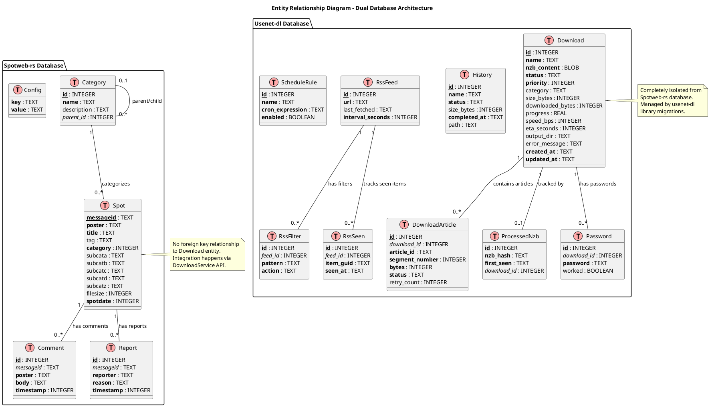

# System Architecture Blueprint: Spotweb-rs Download Integration

**Version:** 1.0
**Date:** 2026-01-23
**Generated By:** Structural_Data_Architect

<!-- anchor: 1-0-introduction-goals -->
## 1. Introduction & Goals

<!-- anchor: 1-1-project-vision -->
### 1.1. Project Vision

The Spotweb-rs Download Integration project aims to transform a spot browsing application into a complete Usenet download management platform by integrating the mature `usenet-dl` backend library with the existing `spotweb-rs` frontend. Users will be able to browse Usenet spots, queue downloads directly from the web interface, and manage their download queue with real-time progress updates—all without needing to manually download and process NZB files externally.

<!-- anchor: 1-2-key-objectives -->
### 1.2. Key Objectives

*   **Unified User Experience:** Provide a seamless workflow from spot discovery to file download completion within a single web application
*   **Real-Time Download Management:** Enable users to monitor download progress, pause/resume operations, and receive live status updates via Server-Sent Events
*   **Queue Control:** Support priority-based download queuing with concurrent download limits and bandwidth management
*   **Post-Processing Automation:** Leverage usenet-dl's built-in Par2 repair, archive extraction, and filename deobfuscation capabilities
*   **Separation of Concerns:** Maintain clean architectural boundaries between the spot browsing domain (spotweb-rs) and download management domain (usenet-dl)
*   **Feature Toggle Discipline:** Allow deployment without download functionality enabled, ensuring backward compatibility and gradual rollout capability
*   **Scalability for Medium Workloads:** Support 10-50 concurrent downloads efficiently on commodity hardware

<!-- anchor: 1-3-scope -->
### 1.3. Scope

This blueprint covers the structural integration of the following components:

**In Scope:**
*   Backend API endpoints for download queue management (`/api/downloads/*`)
*   DownloadService wrapper layer bridging spotweb-rs and usenet-dl
*   Server-Sent Events infrastructure for real-time status updates
*   Configuration translation layer (spotweb-rs config → usenet-dl config)
*   Database schema for both spotweb-rs (spots) and usenet-dl (downloads) persistence
*   Frontend download management UI components (list view, controls, progress display)
*   NZB fetching integration between existing NzbService and new DownloadService

**Out of Scope:**
*   Authentication and authorization mechanisms (future enhancement)
*   User management and multi-tenancy
*   Cloud deployment configurations
*   Mobile application interfaces
*   Modifications to core usenet-dl library functionality
*   Advanced scheduling features (RSS automation uses existing usenet-dl capabilities)

<!-- anchor: 1-4-key-assumptions -->
### 1.4. Key Assumptions

This blueprint is built upon the following assumptions from the foundation document:

*   **Frontend Framework:** Svelte with Vite-based build system, following existing spotweb-rs frontend patterns
*   **Authentication:** Initial implementation has NO authentication; localhost-only deployment (127.0.0.1 binding)
*   **SSE Reconnection:** Frontend implements automatic reconnection with exponential backoff (1s, 2s, 4s, max 30s)
*   **Download Cleanup:** Completed/failed downloads remain in queue until manual deletion (no auto-cleanup)
*   **Error Notification:** Dual approach—toast notifications for real-time events and inline error messages in download list
*   **Batch Downloads:** Sequential queuing only (no multi-select UI in initial release)
*   **Category Management:** Free-text categories without validation or predefined lists
*   **Bandwidth Control:** Configuration-only speed limits (no runtime UI adjustment)
*   **Download History:** Single unified list view with client-side filtering by status
*   **Database Separation:** Two independent SQLite databases (spotweb-rs and usenet-dl) with no cross-database transactions
*   **NZB Fetching Flow:** Backend fetches NZB via existing NzbService before passing to DownloadService
*   **Post-Processing Visibility:** Simplified "Processing..." status in UI (detailed stages hidden from users)
*   **Migration Strategy:** usenet-dl manages its own migrations automatically; spotweb-rs database unchanged
*   **Error Recovery:** Automatic download resumption after backend restart (managed by usenet-dl checkpointing)

<!-- anchor: 2-0-architectural-drivers -->
## 2. Architectural Drivers

<!-- anchor: 2-1-functional-requirements-summary -->
### 2.1. Functional Requirements Summary

The system must support the following core functionalities:

*   **Spot Browsing:** Users can search, filter, and view Usenet spots (existing functionality)
*   **NZB Retrieval:** System fetches NZB metadata from Usenet newsgroups based on spot message IDs (existing)
*   **Download Queuing:** Users can queue spots for download with configurable priority and category
*   **Queue Management:** Users can view all downloads, pause active downloads, resume paused downloads, and cancel/remove downloads
*   **Real-Time Updates:** System broadcasts download progress, speed, ETA, and status changes to connected clients
*   **Article Fetching:** Backend downloads Usenet articles using NNTP protocol across multiple parallel connections
*   **yEnc Decoding:** System decodes yEnc-encoded article bodies and assembles files
*   **Par2 Verification:** System verifies downloaded files using Par2 parity data
*   **Repair Operations:** System automatically repairs corrupted files using Par2 recovery blocks
*   **Archive Extraction:** System extracts RAR, 7-Zip, and ZIP archives with password support
*   **Filename Deobfuscation:** System cleans up obfuscated filenames based on common patterns
*   **Bandwidth Limiting:** System enforces configurable download speed limits using token bucket algorithm
*   **Concurrent Download Control:** System limits number of simultaneous downloads via semaphore

<!-- anchor: 2-2-non-functional-requirements -->
### 2.2. Non-Functional Requirements (NFRs)

<!-- anchor: 2-2-1-performance -->
#### 2.2.1. Performance

*   **Download Throughput:** System must achieve >150 MB/s on gigabit connections with 8+ NNTP connections per download
*   **API Response Time:** REST endpoints must respond within 200ms for list operations and 50ms for control operations (pause/resume/cancel)
*   **SSE Latency:** Event broadcasts must reach clients within 500ms of internal state changes
*   **UI Responsiveness:** Frontend must update progress displays at minimum 1Hz frequency (every second)
*   **Concurrent Downloads:** System must support 10-50 simultaneous downloads without degradation
*   **Database Query Performance:** Download list queries must complete within 100ms for up to 10,000 historical downloads

<!-- anchor: 2-2-2-reliability -->
#### 2.2.2. Reliability

*   **Automatic Retry:** Failed NNTP connections must retry with exponential backoff (managed by usenet-dl)
*   **Crash Recovery:** In-progress downloads must resume from last checkpoint after backend restart
*   **Data Integrity:** Par2 verification must detect and repair data corruption with >95% success rate
*   **Event Delivery:** SSE clients must automatically reconnect and resynchronize state after disconnection

<!-- anchor: 2-2-3-maintainability -->
#### 2.2.3. Maintainability

*   **Separation of Concerns:** Changes to spot browsing functionality must not require modifications to download code
*   **API Versioning Readiness:** REST endpoints must use explicit paths (`/api/downloads`) allowing future versioning
*   **Structured Logging:** All components must emit structured logs via `tracing` crate with appropriate log levels
*   **Configuration Externalization:** All tunable parameters must be defined in configuration files (no hardcoded constants)

<!-- anchor: 2-2-4-security -->
#### 2.2.4. Security

*   **Localhost Binding:** API server must default to 127.0.0.1 to prevent external network exposure
*   **Input Validation:** All API inputs must be validated via serde deserialization with explicit type checking
*   **Path Sanitization:** Output directory paths must be sanitized to prevent directory traversal attacks
*   **Credential Storage:** NNTP passwords must be stored in configuration files with appropriate file permissions (future: encrypted storage)

<!-- anchor: 2-2-5-scalability -->
#### 2.2.5. Scalability

*   **Medium-Scale Focus:** Architecture optimized for 1-3 concurrent users with 10-50 downloads (not thousands)
*   **Resource Efficiency:** Single-process design with shared NNTP connection pools to minimize overhead
*   **Database Scalability:** SQLite suitable for <100k downloads; future migration to PostgreSQL if needed

<!-- anchor: 2-3-constraints-preferences -->
### 2.3. Constraints & Preferences

<!-- anchor: 2-3-1-technology-constraints -->
#### 2.3.1. Technology Constraints

*   **Language:** Rust (mandatory, both existing codebases use Rust)
*   **HTTP Framework:** Axum 0.8 (existing spotweb-rs dependency)
*   **Download Library:** usenet-dl (existing, mature library with 300+ tests)
*   **Database:** SQLite 3.x (existing choice in both codebases)
*   **Async Runtime:** Tokio 1.x (mandatory for Axum and usenet-dl)

<!-- anchor: 2-3-2-architectural-constraints -->
#### 2.3.2. Architectural Constraints

*   **No Microservices:** Monolithic architecture with embedded library (medium scale does not justify microservices complexity)
*   **No External Message Brokers:** In-memory event channels via tokio::sync::broadcast
*   **Separate Databases:** spotweb-rs and usenet-dl maintain independent SQLite databases (no shared schema)
*   **No Authentication (Initial):** Localhost-only deployment, authentication as future enhancement

<!-- anchor: 2-3-3-deployment-constraints -->
#### 2.3.3. Deployment Constraints

*   **Self-Hosted:** On-premise deployment on user-controlled hardware (no cloud services)
*   **External Tool Dependencies:** System requires `unrar` and `7z` binaries in PATH for archive extraction
*   **Single Process:** All components run within single spotweb-rs backend process

<!-- anchor: 3-0-proposed-architecture -->
## 3. Proposed Architecture (Structural View)

<!-- anchor: 3-1-architectural-style -->
### 3.1. Architectural Style

**Style:** Layered Monolith with Service-Oriented Components

**Rationale:**

The architecture adopts a layered monolith approach where the `spotweb-rs` backend serves as the API gateway and orchestration layer, while the `usenet-dl` library is embedded as a specialized download service. This design provides clear separation of concerns without the operational complexity of microservices.

The system is organized into three primary layers:

1.  **Presentation Layer:** Svelte frontend components consuming REST APIs and SSE streams
2.  **Application Layer:** Axum HTTP handlers, DownloadService wrapper, NzbService integration
3.  **Domain/Infrastructure Layer:** usenet-dl download engine, database persistence, NNTP protocol handling

This layered approach enforces dependency rules (upper layers depend on lower layers, never the reverse) while maintaining clean interfaces between components. The service-oriented aspect manifests in the DownloadService abstraction, which provides a domain-specific facade over the generic usenet-dl library.

The monolithic deployment model is appropriate for the medium scale of this project. A single process simplifies debugging, reduces latency (in-memory event channels), and avoids network overhead between components. The embedded library pattern allows leveraging usenet-dl's extensive testing and production-hardened codebase without network serialization costs.

<!-- anchor: 3-2-technology-stack-summary -->
### 3.2. Technology Stack Summary

| Layer | Technology | Version | Purpose |
|-------|-----------|---------|---------|
| **Frontend** | Svelte | 4.x | Component-based UI framework |
| **Frontend Build** | Vite | 5.x | Fast development server and bundler |
| **Backend Framework** | Axum | 0.8 | HTTP server and routing |
| **Async Runtime** | Tokio | 1.x | Asynchronous task execution |
| **Database (spotweb)** | SQLite | 3.x | Spot metadata, comments, configuration |
| **Database (downloads)** | SQLite | 3.x | Download state, articles, history |
| **Database Driver** | sqlx | 0.8 (spotweb), 0.7 (usenet-dl) | Type-safe SQL queries |
| **NNTP Protocol** | nntp-rs | Custom | Usenet protocol client |
| **Download Engine** | usenet-dl | Custom | Queue management, post-processing |
| **API Documentation** | utoipa + Swagger UI | 5.x + 4.x | OpenAPI 3.0 specification |
| **Real-Time Events** | tokio-stream | 0.1 | Server-Sent Events (SSE) |
| **Logging** | tracing | 0.1 | Structured logging |
| **Archive Extraction** | External: unrar, 7z | - | RAR/7-Zip decompression |
| **Par2 Operations** | External: par2 | - | Parity verification and repair |

<!-- anchor: 3-3-system-context-diagram -->
### 3.3. System Context Diagram (C4 Level 1)

<!-- anchor: 3-3-1-context-description -->
#### 3.3.1. Description

The System Context diagram illustrates the Spotweb-rs Download System's position within its operational environment. The primary user persona is an End User who interacts with the system through a web browser to browse Usenet spots and manage downloads. The system communicates with external Usenet servers via the NNTP protocol to fetch spot metadata and download article data. Additionally, the system depends on the local filesystem for storing downloaded files and temporary data, and requires external archive extraction tools (`unrar`, `7z`, `par2`) installed on the host system.

The system boundary encompasses both the Svelte web frontend and the Rust backend services. All interactions between the user and Usenet infrastructure are mediated by this integrated system, which provides value by abstracting the complexity of Usenet protocols and post-processing workflows.

<!-- anchor: 3-3-2-context-diagram -->
#### 3.3.2. Diagram (PlantUML)

```plantuml
@startuml
!include https://raw.githubusercontent.com/plantuml-stdlib/C4-PlantUML/master/C4_Context.puml

LAYOUT_WITH_LEGEND()

title System Context Diagram - Spotweb-rs Download System

Person(user, "End User", "Browses spots and manages downloads via web browser")

System(spotweb_system, "Spotweb-rs Download System", "Provides Usenet spot browsing and integrated download management with real-time progress tracking")

System_Ext(usenet_servers, "Usenet NNTP Servers", "Provides article data and NZB metadata via NNTP protocol")

System_Ext(filesystem, "Local Filesystem", "Stores downloaded files, temporary data, databases, and configuration")

System_Ext(archive_tools, "Archive/Repair Tools", "External binaries: unrar, 7z, par2 for post-processing")

Rel(user, spotweb_system, "Browses spots, queues downloads, monitors progress", "HTTPS/SSE")

Rel(spotweb_system, usenet_servers, "Fetches spots, NZBs, downloads articles", "NNTP/TLS")

Rel(spotweb_system, filesystem, "Reads config, persists state, writes downloads", "File I/O")

Rel(spotweb_system, archive_tools, "Invokes for verification, repair, extraction", "Process execution")

@enduml
```

<!-- anchor: 3-4-container-diagram -->
### 3.4. Container Diagram (C4 Level 2)

<!-- anchor: 3-4-1-container-description -->
#### 3.4.1. Description

The Container diagram decomposes the Spotweb-rs Download System into its major deployable units. The architecture consists of four primary containers:

1.  **Svelte Web Application:** A single-page application (SPA) delivered to the user's browser, providing the UI for spot browsing and download management. It communicates exclusively with the Backend API via HTTP/HTTPS and receives real-time updates through Server-Sent Events.

2.  **Spotweb-rs Backend API:** An Axum-based HTTP server that orchestrates all backend operations. It exposes RESTful endpoints for spot queries and download control, serves the SSE event stream, and coordinates between the NzbService (for fetching NZB metadata), DownloadService (download orchestration), and database layers.

3.  **Spotweb-rs Database:** A SQLite database storing spot metadata, comments, reports, categories, and application configuration. This database is read-heavy, supporting fast queries for the spot browsing interface.

4.  **Usenet-dl Database:** A separate SQLite database dedicated to download state management, including queued/active/completed downloads, article tracking, history, RSS feed configurations, and scheduling rules. This database is write-heavy during active downloads and read-optimized for status queries.

The usenet-dl library itself is not a separate container—it is embedded within the Spotweb-rs Backend API process as a Rust crate dependency. The DownloadService acts as an adapter layer, translating between the spotweb-rs domain model and the usenet-dl library's interfaces.

Data flow follows this pattern: User action → Frontend → Backend API → DownloadService → usenet-dl library → NNTP servers. State changes propagate back through the same layers via event broadcasts (tokio::broadcast channels) and SSE streams.

<!-- anchor: 3-4-2-container-diagram -->
#### 3.4.2. Diagram (PlantUML)

```plantuml
@startuml
!include https://raw.githubusercontent.com/plantuml-stdlib/C4-PlantUML/master/C4_Container.puml

LAYOUT_WITH_LEGEND()

title Container Diagram - Spotweb-rs Download System

Person(user, "End User", "Browses spots and manages downloads")

System_Boundary(spotweb_boundary, "Spotweb-rs Download System") {
    Container(web_app, "Svelte Web Application", "Svelte, Vite", "Provides spot browsing UI, download queue management, real-time progress display")

    Container(backend_api, "Spotweb-rs Backend API", "Rust, Axum 0.8, Tokio", "REST API for spots and downloads, SSE event streaming, orchestrates NZB fetching and download operations")

    ContainerDb(spotweb_db, "Spotweb-rs Database", "SQLite 3.x", "Stores spot metadata, comments, reports, categories, configuration")

    ContainerDb(usenet_dl_db, "Usenet-dl Database", "SQLite 3.x", "Stores download state, articles, history, RSS feeds, schedules")
}

System_Ext(usenet_servers, "Usenet NNTP Servers", "Provides article data via NNTP protocol")

System_Ext(filesystem, "Local Filesystem", "Stores downloads and temp files")

System_Ext(archive_tools, "Archive/Repair Tools", "unrar, 7z, par2 binaries")

Rel(user, web_app, "Interacts with", "HTTPS")

Rel(web_app, backend_api, "API calls, SSE subscription", "HTTPS/JSON, text/event-stream")

Rel(backend_api, spotweb_db, "Reads spot data, writes config", "sqlx queries")

Rel(backend_api, usenet_dl_db, "Reads/writes download state via usenet-dl library", "sqlx queries (indirect)")

Rel(backend_api, usenet_servers, "Fetches spots, NZBs, downloads articles", "NNTP/TLS via nntp-rs")

Rel(backend_api, filesystem, "Writes downloads, reads config", "File I/O")

Rel(backend_api, archive_tools, "Invokes for post-processing", "Process exec")

@enduml
```

<!-- anchor: 3-5-component-diagram -->
### 3.5. Component Diagram (C4 Level 3 - Spotweb-rs Backend API)

<!-- anchor: 3-5-1-component-description -->
#### 3.5.1. Description

The Component diagram details the internal structure of the **Spotweb-rs Backend API** container. The backend is organized into several cohesive components, each with well-defined responsibilities:

**API Layer Components:**

*   **Spots API Handler:** Manages HTTP endpoints for spot search, filtering, and retrieval (`/api/spots/*`). Queries the Spotweb-rs Database and returns JSON responses.

*   **Downloads API Handler:** New component providing download management endpoints (`/api/downloads/*`). Coordinates between NzbService and DownloadService to queue downloads, and exposes control operations (pause, resume, cancel).

*   **SSE Event Broadcaster:** Dedicated component for managing Server-Sent Events connections. Subscribes to the Download Event Channel and streams formatted SSE events to connected clients.

**Service Layer Components:**

*   **NzbService:** Existing component responsible for fetching NZB XML content from Usenet servers based on spot message IDs. Uses the NNTP Connection Pool to retrieve articles from newsgroups.

*   **DownloadService:** New adapter component wrapping the usenet-dl library. Translates spotweb-rs configuration to usenet-dl config, manages the UsenetDownloader instance, subscribes to download events, and provides domain-specific methods (add_download, list_downloads, pause, resume, cancel).

*   **Configuration Manager:** Loads and validates application configuration from files. Provides configuration objects to all components during initialization.

**Infrastructure Components:**

*   **NNTP Connection Pool:** Manages persistent NNTP connections to Usenet servers. Shared by both NzbService (for spot/NZB fetching) and usenet-dl library (for article downloads). Implements connection reuse and automatic reconnection.

*   **Database Connection Pool (Spotweb):** SQLite connection pool for the spotweb-rs database. Used by Spots API Handler for metadata queries.

*   **Download Event Channel:** In-memory tokio::broadcast channel for propagating download lifecycle events (started, progress, status_changed, completed, failed) from usenet-dl to SSE clients.

**Embedded Library:**

*   **usenet-dl Library:** Embedded Rust crate providing download orchestration, queue management, article fetching, yEnc decoding, Par2 verification, archive extraction, and persistence to the usenet-dl database. Accessed exclusively through the DownloadService facade.

Component interactions follow a strict layering: API Handlers → Service Components → Infrastructure/Libraries. The DownloadService component acts as an anti-corruption layer, preventing direct dependencies on usenet-dl types from leaking into the API layer.

<!-- anchor: 3-5-2-component-diagram -->
#### 3.5.2. Diagram (PlantUML)

```plantuml
@startuml
!include https://raw.githubusercontent.com/plantuml-stdlib/C4-PlantUML/master/C4_Component.puml

LAYOUT_WITH_LEGEND()

title Component Diagram - Spotweb-rs Backend API

Container(web_app, "Svelte Web Application", "Svelte", "User interface")

Container_Boundary(backend_api, "Spotweb-rs Backend API") {
    Component(spots_api, "Spots API Handler", "Axum handlers", "Provides spot search, filter, and retrieval endpoints")

    Component(downloads_api, "Downloads API Handler", "Axum handlers", "Provides download queue management and control endpoints")

    Component(sse_broadcaster, "SSE Event Broadcaster", "Axum SSE + tokio-stream", "Streams real-time download events to clients")

    Component(nzb_service, "NzbService", "Rust module", "Fetches NZB content from Usenet based on spot message IDs")

    Component(download_service, "DownloadService", "Rust module", "Adapter wrapping usenet-dl library, translates config and events")

    Component(config_manager, "Configuration Manager", "Rust module", "Loads and validates application configuration")

    Component(nntp_pool, "NNTP Connection Pool", "nntp-rs", "Manages persistent NNTP connections to Usenet servers")

    Component(db_pool_spotweb, "Database Connection Pool (Spotweb)", "sqlx", "SQLite connection pool for spot metadata")

    Component(event_channel, "Download Event Channel", "tokio::broadcast", "In-memory event bus for download lifecycle events")

    Component(usenet_dl_lib, "usenet-dl Library", "Embedded crate", "Download engine: queue, fetch, decode, verify, extract")
}

ContainerDb(spotweb_db, "Spotweb-rs Database", "SQLite")
ContainerDb(usenet_dl_db, "Usenet-dl Database", "SQLite")
System_Ext(usenet_servers, "Usenet NNTP Servers")

Rel(web_app, spots_api, "GET /api/spots/*", "HTTPS/JSON")
Rel(web_app, downloads_api, "POST/GET/DELETE /api/downloads/*", "HTTPS/JSON")
Rel(web_app, sse_broadcaster, "GET /api/downloads/events", "SSE")

Rel(spots_api, db_pool_spotweb, "Query spot metadata")
Rel(db_pool_spotweb, spotweb_db, "SQL queries")

Rel(downloads_api, nzb_service, "Fetch NZB content")
Rel(downloads_api, download_service, "Queue, pause, resume, cancel")

Rel(nzb_service, nntp_pool, "Retrieve NZB articles")

Rel(download_service, usenet_dl_lib, "add_download, list, control operations")
Rel(download_service, config_manager, "Get download config")
Rel(download_service, event_channel, "Subscribe to events")

Rel(usenet_dl_lib, nntp_pool, "Fetch articles via nntp-rs")
Rel(usenet_dl_lib, usenet_dl_db, "Persist download state")
Rel(usenet_dl_lib, event_channel, "Broadcast download events")

Rel(sse_broadcaster, event_channel, "Receive events")

Rel(nntp_pool, usenet_servers, "NNTP protocol")

Rel(config_manager, spotweb_db, "Load configuration")

@enduml
```

<!-- anchor: 3-6-data-model-overview-erd -->
### 3.6. Data Model Overview & ERD

<!-- anchor: 3-6-1-data-model-description -->
#### 3.6.1. Description

The system employs a **dual-database architecture** to maintain separation of concerns between the spot browsing domain and the download management domain. This design ensures that the usenet-dl library remains independently usable and prevents tight coupling between the two codebases.

**Spotweb-rs Database (Spot Metadata):**

This database manages all data related to Usenet spot discovery, indexing, and user interactions. The core entity is the **Spot**, which represents a single Usenet post advertising content. Spots have relationships with **Comments** (user feedback), **Reports** (spam/abuse flags), and **Categories** (classification taxonomy). The database also stores **Configuration** key-value pairs for application settings.

Key characteristics:
*   **Read-heavy:** Primarily queried for spot listings, searches, and detail views
*   **Stable schema:** Infrequently modified (spot structure is standardized)
*   **No download coupling:** Contains no references to download state

**Usenet-dl Database (Download State):**

This database is owned and managed exclusively by the usenet-dl library. It tracks the complete lifecycle of download operations. The central entity is the **Download**, which represents a queued or active download job. Each Download decomposes into multiple **DownloadArticles** (individual Usenet articles to fetch). The database also maintains **ProcessedNzbs** (deduplication), **History** (completed downloads), **Passwords** (archive extraction credentials), **RssFeeds**, **RssFilters**, **RssSeen** (RSS automation), and **ScheduleRules** (time-based scheduling).

Key characteristics:
*   **Write-heavy:** Constantly updated during active downloads (progress, speed, status)
*   **Complex schema:** Supports advanced features (RSS, scheduling, retry logic)
*   **Isolated:** No foreign keys to spotweb-rs database

**Data Synchronization:**

The two databases are synchronized through the **DownloadService** API layer, not through database-level constraints. When a user queues a download:

1.  Frontend calls `POST /api/spots/{messageid}/download`
2.  Downloads API Handler queries Spotweb-rs Database for spot metadata
3.  NzbService fetches NZB content from Usenet
4.  DownloadService passes NZB to usenet-dl library
5.  usenet-dl library creates Download record in Usenet-dl Database
6.  Download ID returned to frontend

This loose coupling allows each database to evolve independently and simplifies backup/restore operations.

<!-- anchor: 3-6-2-key-entities -->
#### 3.6.2. Key Entities

**Spotweb-rs Database Entities:**

*   **Spot:** Represents a Usenet spot post (messageid PK, title, poster, category, subcategories, filesize, spotdate, NZB metadata)
*   **Comment:** User comment on a spot (id PK, messageid FK, poster, body, timestamp)
*   **Report:** Spam/abuse report for a spot (id PK, messageid FK, reporter, reason, timestamp)
*   **Category:** Spot category definition (id PK, name, description, parent_id FK for hierarchy)
*   **Config:** Application configuration key-value pairs (key PK, value)

**Usenet-dl Database Entities:**

*   **Download:** Download job (id PK, name, nzb_content, status, priority, category, size_bytes, downloaded_bytes, progress, speed_bps, eta_seconds, output_dir, error_message, timestamps)
*   **DownloadArticle:** Individual article within a download (id PK, download_id FK, article_id, segment_number, bytes, status, retry_count)
*   **ProcessedNzb:** Deduplication tracker (id PK, nzb_hash, first_seen, download_id FK)
*   **History:** Completed download archive (id PK, name, status, size_bytes, completed_at, path)
*   **Password:** Archive extraction passwords (id PK, download_id FK, password, worked BOOL)
*   **RssFeed:** RSS feed configuration (id PK, url, last_fetched, interval_seconds)
*   **RssFilter:** Content filter rules for RSS feeds (id PK, feed_id FK, pattern, action)
*   **RssSeen:** Seen RSS items tracker (id PK, feed_id FK, item_guid, seen_at)
*   **ScheduleRule:** Time-based scheduling rules (id PK, name, cron_expression, enabled)

<!-- anchor: 3-6-3-erd-diagram -->
#### 3.6.3. Diagram (PlantUML - ERD)



<!-- anchor: 4-0-component-responsibilities -->
## 4. Component Responsibilities & Interfaces

<!-- anchor: 4-1-svelte-web-app-responsibilities -->
### 4.1. Svelte Web Application

**Primary Responsibilities:**
*   Render spot browsing interface with search, filtering, and pagination
*   Display download queue with real-time progress updates
*   Provide user controls for download management (pause, resume, cancel)
*   Establish and maintain SSE connection for event streaming
*   Handle API errors and display user-friendly notifications

**Key Interfaces Consumed:**
*   `GET /api/spots` - Fetch spot listings
*   `GET /api/spots/{messageid}` - Fetch spot details
*   `POST /api/spots/{messageid}/download` - Queue download
*   `GET /api/downloads` - List all downloads
*   `GET /api/downloads/{id}` - Get download details
*   `POST /api/downloads/{id}/pause` - Pause download
*   `POST /api/downloads/{id}/resume` - Resume download
*   `DELETE /api/downloads/{id}` - Cancel/remove download
*   `GET /api/downloads/events` - SSE event stream

**State Management:**
*   Local component state for UI interactions
*   Shared store for download list (synchronized via SSE)
*   SSE connection state (connected, reconnecting, disconnected)

<!-- anchor: 4-2-spotweb-backend-api-responsibilities -->
### 4.2. Spotweb-rs Backend API

**Primary Responsibilities:**
*   Serve HTTP API for spot queries and download operations
*   Orchestrate NZB fetching and download queuing
*   Broadcast download events to SSE clients
*   Validate API inputs and enforce business rules
*   Translate configuration between spotweb-rs and usenet-dl formats

**Key Interfaces Provided:**
*   REST API endpoints (see section 5.2 in foundation document)
*   SSE event stream endpoint

**Key Interfaces Consumed:**
*   Spotweb-rs Database (via sqlx)
*   DownloadService methods (add_download, list_downloads, pause, resume, cancel)
*   NzbService.fetch_nzb(messageid) method
*   Download Event Channel (via tokio::broadcast subscription)

<!-- anchor: 4-3-download-service-responsibilities -->
### 4.3. DownloadService

**Primary Responsibilities:**
*   Wrap usenet-dl library with spotweb-rs domain types
*   Translate configuration from spotweb-rs format to usenet-dl format
*   Subscribe to usenet-dl events and republish to Download Event Channel
*   Provide simplified API for download operations

**Key Interfaces Provided:**

```rust
impl DownloadService {
    /// Initialize service from spotweb-rs configuration
    pub async fn new(config: &Config) -> Result<Self>;

    /// Subscribe to download events
    pub fn subscribe(&self) -> broadcast::Receiver<Event>;

    /// Queue NZB for download
    pub async fn add_download(
        &self,
        nzb_content: &[u8],
        name: String,
        options: QueueOptions
    ) -> Result<i64>;

    /// List all downloads with current status
    pub async fn list_downloads(&self) -> Result<Vec<DownloadInfo>>;

    /// Get single download details
    pub async fn get_download(&self, id: i64) -> Result<Option<DownloadInfo>>;

    /// Pause active download
    pub async fn pause(&self, id: i64) -> Result<()>;

    /// Resume paused download
    pub async fn resume(&self, id: i64) -> Result<()>;

    /// Cancel and remove download
    pub async fn cancel(&self, id: i64) -> Result<()>;

    /// Get queue statistics
    pub async fn queue_stats(&self) -> Result<QueueStats>;
}
```

**Key Interfaces Consumed:**
*   `usenet_dl::UsenetDownloader` (all methods)
*   Configuration Manager (for initialization)

<!-- anchor: 4-4-nzb-service-responsibilities -->
### 4.4. NzbService

**Primary Responsibilities:**
*   Fetch NZB XML content from Usenet newsgroups
*   Parse spot metadata to determine NZB location
*   Handle NNTP connection errors and retries

**Key Interfaces Provided:**

```rust
impl NzbService {
    /// Fetch NZB content for a spot
    pub async fn fetch_nzb(&self, messageid: &str) -> Result<Vec<u8>>;

    /// Parse NZB XML and extract metadata
    pub fn parse_nzb_metadata(&self, content: &[u8]) -> Result<NzbMetadata>;
}
```

**Key Interfaces Consumed:**
*   NNTP Connection Pool (via nntp-rs library)
*   Spotweb-rs Database (for spot metadata lookup)

<!-- anchor: 4-5-usenet-dl-library-responsibilities -->
### 4.5. usenet-dl Library (Embedded)

**Primary Responsibilities:**
*   Manage download queue with priority ordering
*   Fetch Usenet articles across multiple NNTP connections
*   Decode yEnc-encoded article bodies
*   Assemble articles into files
*   Verify files using Par2 parity data
*   Repair corrupted files using Par2 recovery
*   Extract RAR, 7-Zip, and ZIP archives
*   Deobfuscate filenames based on patterns
*   Persist download state to usenet-dl database
*   Broadcast download lifecycle events

**Key Interfaces Provided (via UsenetDownloader):**

```rust
impl UsenetDownloader {
    /// Initialize downloader with configuration
    pub async fn new(config: Config) -> Result<Self>;

    /// Add NZB to download queue
    pub async fn add_nzb(&self, name: String, nzb_content: &[u8], options: AddNzbOptions) -> Result<i64>;

    /// List all downloads
    pub async fn list_downloads(&self) -> Result<Vec<DownloadInfo>>;

    /// Pause download by ID
    pub async fn pause_download(&self, id: i64) -> Result<()>;

    /// Resume download by ID
    pub async fn resume_download(&self, id: i64) -> Result<()>;

    /// Cancel download by ID
    pub async fn cancel_download(&self, id: i64) -> Result<()>;

    /// Subscribe to download events
    pub fn subscribe(&self) -> broadcast::Receiver<Event>;
}
```

**Key Interfaces Consumed:**
*   NNTP Connection Pool (via nntp-rs library)
*   Usenet-dl Database (via sqlx)
*   Local Filesystem (for downloads and temp files)
*   External Tools (unrar, 7z, par2 via process execution)

<!-- anchor: 4-6-database-schemas -->
### 4.6. Database Schemas

<!-- anchor: 4-6-1-spotweb-database-schema -->
#### 4.6.1. Spotweb-rs Database Schema

**Spots Table:**
```sql
CREATE TABLE spots (
    messageid TEXT PRIMARY KEY,
    poster TEXT NOT NULL,
    title TEXT NOT NULL,
    tag TEXT,
    category INTEGER NOT NULL,
    subcata TEXT,
    subcatb TEXT,
    subcatc TEXT,
    subcatd TEXT,
    subcatz TEXT,
    filesize INTEGER,
    spotdate INTEGER NOT NULL,
    -- Additional fields: nzbsegment, headersign, etc.
    INDEX idx_spotdate ON spots(spotdate),
    INDEX idx_category ON spots(category)
);
```

**Comments Table:**
```sql
CREATE TABLE comments (
    id INTEGER PRIMARY KEY AUTOINCREMENT,
    messageid TEXT NOT NULL,
    poster TEXT NOT NULL,
    body TEXT NOT NULL,
    timestamp INTEGER NOT NULL,
    FOREIGN KEY (messageid) REFERENCES spots(messageid) ON DELETE CASCADE,
    INDEX idx_messageid ON comments(messageid)
);
```

**Reports Table:**
```sql
CREATE TABLE reports (
    id INTEGER PRIMARY KEY AUTOINCREMENT,
    messageid TEXT NOT NULL,
    reporter TEXT NOT NULL,
    reason TEXT NOT NULL,
    timestamp INTEGER NOT NULL,
    FOREIGN KEY (messageid) REFERENCES spots(messageid) ON DELETE CASCADE,
    INDEX idx_messageid ON reports(messageid)
);
```

**Categories Table:**
```sql
CREATE TABLE categories (
    id INTEGER PRIMARY KEY,
    name TEXT NOT NULL,
    description TEXT,
    parent_id INTEGER,
    FOREIGN KEY (parent_id) REFERENCES categories(id)
);
```

**Config Table:**
```sql
CREATE TABLE config (
    key TEXT PRIMARY KEY,
    value TEXT NOT NULL
);
```

<!-- anchor: 4-6-2-usenet-dl-database-schema -->
#### 4.6.2. Usenet-dl Database Schema

**Downloads Table:**
```sql
CREATE TABLE downloads (
    id INTEGER PRIMARY KEY AUTOINCREMENT,
    name TEXT NOT NULL,
    nzb_content BLOB NOT NULL,
    status TEXT NOT NULL CHECK(status IN ('queued', 'downloading', 'paused', 'processing', 'completed', 'failed')),
    priority INTEGER NOT NULL DEFAULT 0,
    category TEXT,
    size_bytes INTEGER,
    downloaded_bytes INTEGER DEFAULT 0,
    progress REAL DEFAULT 0.0,
    speed_bps INTEGER DEFAULT 0,
    eta_seconds INTEGER,
    output_dir TEXT,
    error_message TEXT,
    created_at TEXT NOT NULL,
    updated_at TEXT NOT NULL,
    INDEX idx_status ON downloads(status),
    INDEX idx_created_at ON downloads(created_at)
);
```

**DownloadArticles Table:**
```sql
CREATE TABLE download_articles (
    id INTEGER PRIMARY KEY AUTOINCREMENT,
    download_id INTEGER NOT NULL,
    article_id TEXT NOT NULL,
    segment_number INTEGER NOT NULL,
    bytes INTEGER NOT NULL,
    status TEXT NOT NULL CHECK(status IN ('pending', 'downloading', 'completed', 'failed')),
    retry_count INTEGER DEFAULT 0,
    FOREIGN KEY (download_id) REFERENCES downloads(id) ON DELETE CASCADE,
    INDEX idx_download_id ON download_articles(download_id),
    INDEX idx_status ON download_articles(status)
);
```

**ProcessedNzbs Table:**
```sql
CREATE TABLE processed_nzbs (
    id INTEGER PRIMARY KEY AUTOINCREMENT,
    nzb_hash TEXT NOT NULL UNIQUE,
    first_seen TEXT NOT NULL,
    download_id INTEGER,
    FOREIGN KEY (download_id) REFERENCES downloads(id)
);
```

**History Table:**
```sql
CREATE TABLE history (
    id INTEGER PRIMARY KEY AUTOINCREMENT,
    name TEXT NOT NULL,
    status TEXT NOT NULL,
    size_bytes INTEGER,
    completed_at TEXT NOT NULL,
    path TEXT,
    INDEX idx_completed_at ON history(completed_at)
);
```

**Passwords Table:**
```sql
CREATE TABLE passwords (
    id INTEGER PRIMARY KEY AUTOINCREMENT,
    download_id INTEGER NOT NULL,
    password TEXT NOT NULL,
    worked BOOLEAN DEFAULT 0,
    FOREIGN KEY (download_id) REFERENCES downloads(id) ON DELETE CASCADE
);
```

**RssFeeds Table:**
```sql
CREATE TABLE rss_feeds (
    id INTEGER PRIMARY KEY AUTOINCREMENT,
    url TEXT NOT NULL UNIQUE,
    last_fetched TEXT,
    interval_seconds INTEGER NOT NULL DEFAULT 3600
);
```

**RssFilters Table:**
```sql
CREATE TABLE rss_filters (
    id INTEGER PRIMARY KEY AUTOINCREMENT,
    feed_id INTEGER NOT NULL,
    pattern TEXT NOT NULL,
    action TEXT NOT NULL CHECK(action IN ('download', 'ignore')),
    FOREIGN KEY (feed_id) REFERENCES rss_feeds(id) ON DELETE CASCADE
);
```

**RssSeen Table:**
```sql
CREATE TABLE rss_seen (
    id INTEGER PRIMARY KEY AUTOINCREMENT,
    feed_id INTEGER NOT NULL,
    item_guid TEXT NOT NULL,
    seen_at TEXT NOT NULL,
    FOREIGN KEY (feed_id) REFERENCES rss_feeds(id) ON DELETE CASCADE,
    UNIQUE(feed_id, item_guid)
);
```

**ScheduleRules Table:**
```sql
CREATE TABLE schedule_rules (
    id INTEGER PRIMARY KEY AUTOINCREMENT,
    name TEXT NOT NULL,
    cron_expression TEXT NOT NULL,
    enabled BOOLEAN NOT NULL DEFAULT 1
);
```

<!-- anchor: 5-0-cross-cutting-structural-concerns -->
## 5. Cross-Cutting Structural Concerns

<!-- anchor: 5-1-configuration-management -->
### 5.1. Configuration Management

**Configuration File Structure:**

The system uses a single JSON configuration file for spotweb-rs, with a new `download` section:

```json
{
  "listen_addr": "127.0.0.1:8484",
  "database_path": "/path/to/spotweb.db",
  "nntp": {
    "binary_server": {
      "host": "news.provider.com",
      "port": 563,
      "ssl": true,
      "username": "user",
      "password": "pass",
      "max_connections": 20
    }
  },
  "download": {
    "enabled": false,
    "download_dir": "/path/to/downloads",
    "temp_dir": "/path/to/temp",
    "max_concurrent_downloads": 3,
    "speed_limit_bps": null,
    "database_path": "/path/to/usenet-dl.db",
    "nntp_connections_per_download": 8,
    "enable_par2_repair": true,
    "enable_extraction": true,
    "enable_deobfuscation": true,
    "delete_failed_downloads": false
  }
}
```

**Configuration Translation (spotweb-rs → usenet-dl):**

The DownloadService.new() method performs configuration translation:

```rust
impl DownloadService {
    pub async fn new(config: &Config) -> Result<Self> {
        let download_config = &config.download;

        // Translate NNTP server configuration
        let server_config = usenet_dl::ServerConfig {
            host: config.nntp.binary_server.host.clone(),
            port: config.nntp.binary_server.port,
            use_tls: config.nntp.binary_server.ssl,
            username: config.nntp.binary_server.username.clone(),
            password: config.nntp.binary_server.password.clone(),
            max_connections: download_config.nntp_connections_per_download,
        };

        // Construct usenet-dl configuration
        let usenet_dl_config = usenet_dl::Config {
            servers: vec![server_config],
            download_dir: download_config.download_dir.clone(),
            temp_dir: download_config.temp_dir.clone(),
            concurrent_limit: download_config.max_concurrent_downloads,
            speed_limit_bps: download_config.speed_limit_bps,
            database_path: download_config.database_path.clone(),
            enable_par2: download_config.enable_par2_repair,
            enable_extraction: download_config.enable_extraction,
            enable_deobfuscation: download_config.enable_deobfuscation,
        };

        let downloader = UsenetDownloader::new(usenet_dl_config).await?;
        let event_tx = broadcast::channel(1000).0;

        // Spawn task to forward usenet-dl events to our channel
        let mut event_rx = downloader.subscribe();
        let event_tx_clone = event_tx.clone();
        tokio::spawn(async move {
            while let Ok(event) = event_rx.recv().await {
                let _ = event_tx_clone.send(event);
            }
        });

        Ok(Self {
            downloader: Arc::new(downloader),
            event_tx,
        })
    }
}
```

<!-- anchor: 5-2-event-propagation-architecture -->
### 5.2. Event Propagation Architecture

**Event Flow Diagram:**

```
usenet-dl Library
    |
    | (internal broadcast channel)
    v
DownloadService Event Forwarder Task
    |
    | (republish to spotweb-rs channel)
    v
Download Event Channel (tokio::broadcast)
    |
    +---> SSE Event Broadcaster ---> Connected Clients
    |
    +---> (Future) Logging/Metrics Subscribers
```

**Event Types:**

```rust
#[derive(Clone, Debug, Serialize)]
#[serde(tag = "event", content = "data")]
pub enum DownloadEvent {
    DownloadStarted {
        download_id: i64,
        name: String,
    },
    DownloadProgress {
        download_id: i64,
        progress: f32,
        speed_bps: u64,
        eta_seconds: Option<u64>,
    },
    DownloadStatusChanged {
        download_id: i64,
        status: DownloadStatus,
        stage: Option<String>,
    },
    DownloadCompleted {
        download_id: i64,
        name: String,
        path: String,
    },
    DownloadFailed {
        download_id: i64,
        error: String,
    },
}
```

**SSE Broadcast Implementation:**

The SSE Event Broadcaster component converts internal events to SSE format:

```rust
pub async fn sse_handler(
    State(app_state): State<Arc<AppState>>,
) -> Sse<impl Stream<Item = Result<Event, Infallible>>> {
    let download_service = app_state.download_service
        .as_ref()
        .expect("Download service not initialized");

    let rx = download_service.subscribe();

    let stream = BroadcastStream::new(rx)
        .filter_map(|result| async move {
            match result {
                Ok(event) => {
                    let event_name = event.event_name();
                    let json_data = serde_json::to_string(&event).ok()?;
                    Some(Ok(Event::default().event(event_name).data(json_data)))
                }
                Err(_) => None, // Lagged, skip
            }
        });

    Sse::new(stream).keep_alive(KeepAlive::default())
}
```

<!-- anchor: 5-3-error-handling-architecture -->
### 5.3. Error Handling Architecture

**Error Type Hierarchy:**

```rust
#[derive(Debug, thiserror::Error)]
pub enum DownloadServiceError {
    #[error("Download feature is disabled in configuration")]
    FeatureDisabled,

    #[error("Download not found: {0}")]
    NotFound(i64),

    #[error("Invalid download state: {0}")]
    InvalidState(String),

    #[error("NZB fetch failed: {0}")]
    NzbFetchError(#[from] NzbServiceError),

    #[error("usenet-dl library error: {0}")]
    UsenetDlError(String),

    #[error("Database error: {0}")]
    DatabaseError(#[from] sqlx::Error),

    #[error("Configuration error: {0}")]
    ConfigError(String),
}
```

**HTTP Error Mapping:**

```rust
impl IntoResponse for DownloadServiceError {
    fn into_response(self) -> Response {
        let (status, error_message) = match self {
            Self::FeatureDisabled => (StatusCode::NOT_IMPLEMENTED, self.to_string()),
            Self::NotFound(_) => (StatusCode::NOT_FOUND, self.to_string()),
            Self::InvalidState(_) => (StatusCode::CONFLICT, self.to_string()),
            Self::NzbFetchError(_) => (StatusCode::BAD_GATEWAY, self.to_string()),
            Self::UsenetDlError(_) | Self::DatabaseError(_) | Self::ConfigError(_) => {
                (StatusCode::INTERNAL_SERVER_ERROR, self.to_string())
            }
        };

        let body = Json(json!({
            "error": error_message
        }));

        (status, body).into_response()
    }
}
```

<!-- anchor: 5-4-concurrency-control -->
### 5.4. Concurrency Control

**NNTP Connection Pooling:**

The system uses two separate NNTP connection pools:

1.  **Spotweb-rs Pool:** Used by NzbService for fetching spot metadata and NZB files. Typically 2-5 connections.
2.  **Usenet-dl Pool:** Used by download engine for article fetching. Configured via `nntp_connections_per_download` (typically 8+ connections).

**Download Concurrency Limiting:**

The usenet-dl library enforces download concurrency using a Tokio semaphore:

```rust
pub struct UsenetDownloader {
    download_semaphore: Arc<Semaphore>,
    queue: Arc<Mutex<BinaryHeap<QueuedDownload>>>,
    // ...
}

impl UsenetDownloader {
    async fn process_queue(&self) {
        loop {
            let download = {
                let mut queue = self.queue.lock().await;
                queue.pop()
            };

            if let Some(download) = download {
                let permit = self.download_semaphore.acquire().await.unwrap();
                let downloader = self.clone();
                tokio::spawn(async move {
                    downloader.execute_download(download).await;
                    drop(permit); // Release semaphore
                });
            } else {
                tokio::time::sleep(Duration::from_secs(1)).await;
            }
        }
    }
}
```

**Database Connection Pooling:**

Both databases use sqlx connection pools:

```rust
// Spotweb-rs database pool
let spotweb_pool = SqlitePoolOptions::new()
    .max_connections(5) // Low concurrency, read-heavy
    .connect(&config.database_path)
    .await?;

// Usenet-dl database pool (managed internally by library)
// Typically 10-20 connections for write-heavy workload
```

<!-- anchor: 6-0-deployment-view -->
## 6. Deployment View

<!-- anchor: 6-1-deployment-architecture -->
### 6.1. Deployment Architecture

**Single-Process Deployment:**

The system deploys as a single Rust binary (`spotweb-rs`) containing all components:

```
┌─────────────────────────────────────────────────┐
│           Host Machine (Linux/macOS/Windows)     │
│                                                  │
│  ┌────────────────────────────────────────────┐ │
│  │      spotweb-rs Process (Port 8484)        │ │
│  │                                            │ │
│  │  ┌──────────────────────────────────────┐ │ │
│  │  │  Axum HTTP Server                    │ │ │
│  │  │  - Spots API                         │ │ │
│  │  │  - Downloads API                     │ │ │
│  │  │  - SSE Broadcaster                   │ │ │
│  │  │  - Static File Serving (frontend)    │ │ │
│  │  └──────────────────────────────────────┘ │ │
│  │                                            │ │
│  │  ┌──────────────────────────────────────┐ │ │
│  │  │  DownloadService + usenet-dl Library │ │ │
│  │  │  - Download Queue Management         │ │ │
│  │  │  - NNTP Article Fetching             │ │ │
│  │  │  - Post-Processing Pipeline          │ │ │
│  │  └──────────────────────────────────────┘ │ │
│  └────────────────────────────────────────────┘ │
│                                                  │
│  ┌──────────────┐  ┌───────────────────────┐   │
│  │ spotweb.db   │  │ usenet-dl.db          │   │
│  │ (SQLite)     │  │ (SQLite)              │   │
│  └──────────────┘  └───────────────────────┘   │
│                                                  │
│  ┌──────────────────────────────────────────┐  │
│  │  /downloads/  (Output Directory)        │   │
│  │  /temp/       (Temporary Files)          │   │
│  └──────────────────────────────────────────┘  │
│                                                  │
│  ┌──────────────────────────────────────────┐  │
│  │  External Tools (in PATH)                │   │
│  │  - unrar                                 │   │
│  │  - 7z                                    │   │
│  │  - par2 (optional)                       │   │
│  └──────────────────────────────────────────┘  │
└─────────────────────────────────────────────────┘
         │
         │ NNTP/TLS (Port 563)
         v
   ┌─────────────────┐
   │ Usenet Servers  │
   │ (External)      │
   └─────────────────┘
```

<!-- anchor: 6-2-deployment-configuration -->
### 6.2. Deployment Configuration

**System Requirements:**

*   **OS:** Linux (preferred), macOS, Windows
*   **CPU:** 2+ cores (4+ recommended for concurrent downloads)
*   **RAM:** 2GB minimum, 4GB+ recommended
*   **Disk:** 100GB+ for download storage, SSD recommended for database I/O
*   **Network:** Gigabit connection to maximize Usenet download speeds

**Required Software:**

*   Rust 1.75+ (for compilation)
*   SQLite 3.x
*   `unrar` binary (for RAR extraction)
*   `7z` binary (for 7-Zip extraction)
*   `par2` binary (optional, for Par2 repair)

**Firewall Configuration:**

*   **Inbound:** Port 8484 (HTTP) - bound to 127.0.0.1 by default (no external exposure)
*   **Outbound:** Port 563 (NNTP over TLS) - allow connections to Usenet provider

**File System Layout:**

```
/opt/spotweb-rs/
├── spotweb-rs                  # Binary
├── config.json                 # Configuration file
├── spotweb.db                  # Spotweb-rs database
├── usenet-dl.db                # Usenet-dl database
├── static/                     # Frontend assets
│   ├── index.html
│   ├── assets/
│   └── ...
├── downloads/                  # Downloaded files
│   ├── category1/
│   └── category2/
└── temp/                       # Temporary files (par2, extraction)
    └── ...
```

<!-- anchor: 6-3-startup-sequence -->
### 6.3. Startup Sequence

**Initialization Order:**

1.  **Load Configuration:** Parse `config.json`, validate required fields
2.  **Initialize Spotweb-rs Database:** Connect to SQLite, run migrations if needed
3.  **Initialize NzbService:** Set up NNTP connection pool for spot fetching
4.  **Initialize DownloadService (if enabled):**
    *   Translate configuration to usenet-dl format
    *   Initialize UsenetDownloader (connects to usenet-dl database, runs migrations)
    *   Start event forwarding task
5.  **Build Axum Router:** Register API routes, SSE handler, static file serving
6.  **Bind HTTP Server:** Listen on configured address (default: 127.0.0.1:8484)
7.  **Start Download Queue Processor:** Begin processing queued downloads (resumes in-progress downloads from database)
8.  **Log Ready Message:** Emit INFO-level log indicating server is ready

**Graceful Shutdown Sequence:**

1.  **Receive SIGTERM/SIGINT:** Trap shutdown signal
2.  **Stop Accepting New HTTP Connections:** Close HTTP server listener
3.  **Pause Download Queue:** Stop dequeuing new downloads
4.  **Wait for Active Downloads:** Allow in-progress downloads to reach safe checkpoint (configurable timeout, default 30s)
5.  **Close Database Connections:** Flush pending writes, close pools
6.  **Exit Process**

**Automatic Restart Behavior:**

*   In-progress downloads resume from last checkpoint (usenet-dl stores article-level progress)
*   SSE clients reconnect automatically (exponential backoff)
*   No data loss for completed articles (idempotent article fetching)

<!-- anchor: 7-0-scalability-evolution-paths -->
## 7. Scalability & Evolution Paths

<!-- anchor: 7-1-current-scale-limitations -->
### 7.1. Current Scale Limitations

**Design Constraints for Medium Scale:**

*   **Single-Process Architecture:** No horizontal scaling across multiple machines
*   **SQLite Databases:** Limited to ~100k downloads before query performance degrades
*   **In-Memory Event Bus:** Events lost if no subscribers connected (no event persistence)
*   **Localhost-Only Binding:** No multi-user support or remote access

**Expected Performance Envelope:**

*   **Concurrent Downloads:** 10-50 (limited by `max_concurrent_downloads` configuration)
*   **Concurrent Users:** 1-3 (single-user focus, no authentication)
*   **Download Throughput:** >150 MB/s on gigabit connection (already achieved)
*   **API Response Time:** <200ms for list operations, <50ms for control operations
*   **Database Size:** <10GB (typical for 1-2 years of download history)

<!-- anchor: 7-2-evolution-path-to-large-scale -->
### 7.2. Evolution Path to Large Scale

**Phase 1: Multi-User Support (Small → Medium+)**

*   **Add Authentication:** JWT-based auth with user table in spotweb-rs database
*   **User Isolation:** Add `user_id` column to downloads table, enforce row-level security
*   **External Binding:** Allow configuration of listen address beyond 127.0.0.1 (with authentication mandatory)
*   **Architecture Impact:** Minimal - add auth middleware layer, no structural changes

**Phase 2: Database Migration (Medium → Large)**

*   **Replace SQLite with PostgreSQL:** Migrate both databases to PostgreSQL for better concurrency
*   **Add Connection Pooling:** Use PgBouncer or similar for connection management
*   **Separate Read/Write Paths:** Implement read replicas for download list queries
*   **Architecture Impact:** Moderate - update sqlx queries, add migration tooling

**Phase 3: Distributed Download Workers (Large → Enterprise)**

*   **Separate Download Engine:** Extract usenet-dl into standalone worker processes
*   **Add Message Queue:** Replace in-memory event channel with Redis Streams or RabbitMQ
*   **Horizontal Scaling:** Run multiple download workers behind load balancer
*   **Architecture Impact:** Major - redesign deployment model, add orchestration layer

**Phase 4: Microservices Decomposition (Enterprise)**

*   **Split Services:** Separate Spot Indexer, Download Manager, Post-Processor into independent services
*   **Add API Gateway:** Use Envoy or similar for service mesh
*   **Event Sourcing:** Replace databases with event-sourced architecture (e.g., Kafka + CQRS)
*   **Architecture Impact:** Complete redesign - only domain models preserved

<!-- anchor: 7-3-future-enhancement-hooks -->
### 7.3. Future Enhancement Hooks

**Prepared Extension Points:**

1.  **Authentication Readiness:** Database schema can add `user_id` columns with NULL default (backward compatible)
2.  **API Versioning:** Explicit `/api/` path prefix allows future `/api/v2/` routes
3.  **Event Persistence:** Event channel design allows adding persistent subscriber without changing publishers
4.  **Category Management:** Free-text category field can migrate to foreign key with lookup table
5.  **Bandwidth Control UI:** Configuration-based limits can expose `/api/config/speed_limit` endpoint for runtime adjustment

**Structural Integrity for Evolution:**

All evolution paths preserve the core architectural principle: **Separation of Concerns**. The usenet-dl library remains independently usable (could be extracted to standalone service). The spotweb-rs frontend consumes only documented REST APIs (backend implementation can be replaced). Database schemas avoid circular dependencies (migrations are independent).

---

**END OF DOCUMENT**

*This architectural blueprint was generated by the Structural_Data_Architect on 2026-01-23. All diagrams, schemas, and component definitions MUST be considered authoritative for implementation. Deviations from this structure require explicit approval and updated documentation.*
