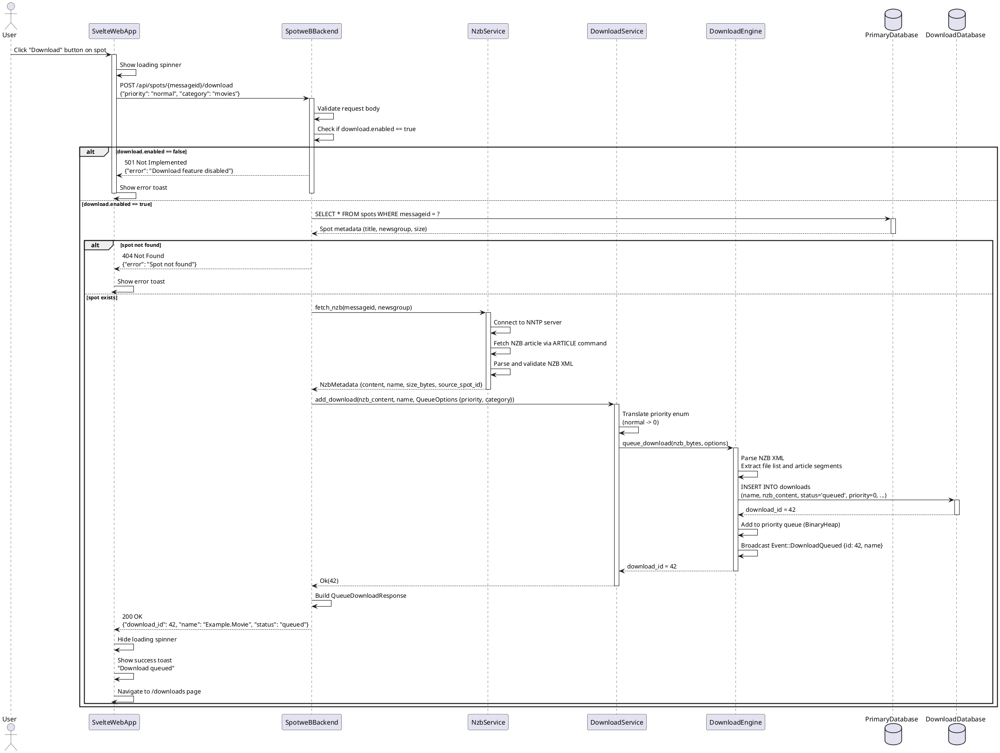
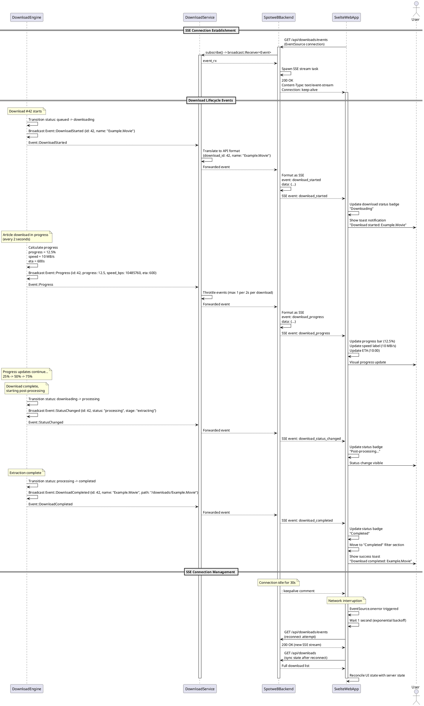

```plantuml
@startuml
actor User
participant SvelteWebApp
participant SpotweBBackend
participant DownloadService
participant DownloadEngine
database DownloadDatabase

== Pause Download ==

note over SvelteWebApp: Download #42 is actively downloading\nstatus = "downloading", progress = 45%

User -> SvelteWebApp: Click "Pause" button on download #42
activate SvelteWebApp

SvelteWebApp -> SvelteWebApp: Disable pause button\nShow loading indicator
SvelteWebApp -> SpotweBBackend: POST /api/downloads/42/pause
activate SpotweBBackend

SpotweBBackend -> SpotweBBackend: Validate download ID format
SpotweBBackend -> DownloadService: pause(id: 42)
activate DownloadService

DownloadService -> DownloadEngine: pause_download(id: 42)
activate DownloadEngine

DownloadEngine -> DownloadEngine: Validate current status\nCurrent: "downloading" (valid for pause)
DownloadEngine -> DownloadEngine: Cancel download task (CancellationToken)
DownloadEngine -> DownloadEngine: Close active NNTP connections
DownloadEngine -> DownloadDatabase: UPDATE downloads\nSET status = 'paused', updated_at = NOW()\nWHERE id = 42
activate DownloadDatabase
DownloadDatabase --> DownloadEngine: 1 row updated
deactivate DownloadDatabase

DownloadEngine -> DownloadEngine: Broadcast Event::StatusChanged {id: 42, status: "paused"}
DownloadEngine --> DownloadService: Ok(())
deactivate DownloadEngine

DownloadService --> SpotweBBackend: Ok(())
deactivate DownloadService

SpotweBBackend --> SvelteWebApp: 204 No Content
deactivate SpotweBBackend

SvelteWebApp -> SvelteWebApp: Re-enable pause button (now "Resume")
SvelteWebApp -> SvelteWebApp: Show "Paused" badge
note over SvelteWebApp: SSE event arrives asynchronously
SvelteWebApp -> SvelteWebApp: Receive SSE: download_status_changed\n{id: 42, status: "paused"}
SvelteWebApp -> SvelteWebApp: Update UI state (confirm paused)
deactivate SvelteWebApp

== Resume Download ==

User -> SvelteWebApp: Click "Resume" button on download #42
activate SvelteWebApp

SvelteWebApp -> SpotweBBackend: POST /api/downloads/42/resume
activate SpotweBBackend

SpotweBBackend -> DownloadService: resume(id: 42)
activate DownloadService

DownloadService -> DownloadEngine: resume_download(id: 42)
activate DownloadEngine

DownloadEngine -> DownloadEngine: Validate current status\nCurrent: "paused" (valid for resume)
DownloadEngine -> DownloadDatabase: UPDATE downloads\nSET status = 'queued', updated_at = NOW()\nWHERE id = 42
activate DownloadDatabase
DownloadDatabase --> DownloadEngine: 1 row updated
deactivate DownloadDatabase

DownloadEngine -> DownloadEngine: Re-add to priority queue (BinaryHeap)
DownloadEngine -> DownloadEngine: Broadcast Event::StatusChanged {id: 42, status: "queued"}
DownloadEngine -> DownloadEngine: Trigger queue processor (semaphore permit available)
DownloadEngine -> DownloadEngine: Transition queued -> downloading
DownloadEngine -> DownloadEngine: Broadcast Event::DownloadStarted {id: 42}

DownloadEngine --> DownloadService: Ok(())
deactivate DownloadEngine

DownloadService --> SpotweBBackend: Ok(())
deactivate DownloadService

SpotweBBackend --> SvelteWebApp: 204 No Content
deactivate SpotweBBackend

SvelteWebApp -> SvelteWebApp: Update button to "Pause"
SvelteWebApp -> SvelteWebApp: Receive SSE events: status_changed, download_started
SvelteWebApp -> SvelteWebApp: Update status badge "Downloading"
deactivate SvelteWebApp

== Cancel/Remove Download ==

User -> SvelteWebApp: Click "Cancel" button (trash icon) on download #42
activate SvelteWebApp

SvelteWebApp -> SvelteWebApp: Show confirmation dialog\n"Remove download #42?"
User -> SvelteWebApp: Confirm removal

SvelteWebApp -> SpotweBBackend: DELETE /api/downloads/42
activate SpotweBBackend

SpotweBBackend -> DownloadService: cancel(id: 42)
activate DownloadService

DownloadService -> DownloadEngine: cancel_download(id: 42)
activate DownloadEngine

DownloadEngine -> DownloadEngine: Validate download exists
DownloadEngine -> DownloadEngine: Cancel active download task (if running)
DownloadEngine -> DownloadEngine: Delete partial files from temp_dir
DownloadEngine -> DownloadDatabase: DELETE FROM download_articles WHERE download_id = 42
activate DownloadDatabase
DownloadDatabase --> DownloadEngine: Articles deleted
DownloadEngine -> DownloadDatabase: DELETE FROM downloads WHERE id = 42
DownloadDatabase --> DownloadEngine: Download deleted
deactivate DownloadDatabase

DownloadEngine -> DownloadEngine: Remove from priority queue
DownloadEngine -> DownloadEngine: Broadcast Event::DownloadRemoved {id: 42}

DownloadEngine --> DownloadService: Ok(())
deactivate DownloadEngine

DownloadService --> SpotweBBackend: Ok(())
deactivate DownloadService

SpotweBBackend --> SvelteWebApp: 204 No Content
deactivate SpotweBBackend

SvelteWebApp -> SvelteWebApp: Remove download #42 from UI list
SvelteWebApp -> SvelteWebApp: Receive SSE: download_removed {id: 42}
SvelteWebApp -> SvelteWebApp: Confirm removal (no-op, already removed)
SvelteWebApp -> User: Show toast "Download removed"
deactivate SvelteWebApp

== Error Case: Invalid State Transition ==

User -> SvelteWebApp: Click "Pause" on already-paused download #99
activate SvelteWebApp

SvelteWebApp -> SpotweBBackend: POST /api/downloads/99/pause
activate SpotweBBackend

SpotweBBackend -> DownloadService: pause(id: 99)
activate DownloadService

DownloadService -> DownloadEngine: pause_download(id: 99)
activate DownloadEngine

DownloadEngine -> DownloadEngine: Validate current status\nCurrent: "paused" (INVALID for pause)
DownloadEngine --> DownloadService: Err(InvalidStateTransition)
deactivate DownloadEngine

DownloadService -> DownloadService: Translate error to API format
DownloadService --> SpotweBBackend: Err(ApiError::BadRequest)
deactivate DownloadService

SpotweBBackend --> SvelteWebApp: 400 Bad Request\n{"error": "Download is already paused", "code": "INVALID_STATE"}
deactivate SpotweBBackend

SvelteWebApp -> SvelteWebApp: Parse error response
SvelteWebApp -> SvelteWebApp: Show error toast\n"Cannot pause: already paused"
SvelteWebApp -> SvelteWebApp: Refresh download list (GET /api/downloads)
deactivate SvelteWebApp

@enduml
```

# 03_Behavior_and_Communication.md

<!-- anchor: 1-0-introduction -->
## 1.0 Introduction

This document defines the **Behavioral and Communication Architecture** for the spotweb-rs download management integration project. It specifies how the components defined in the Foundation Blueprint (01_Blueprint_Foundation.md) interact dynamically to fulfill user journeys and business processes. All communication patterns, API interactions, data flows, and sequence diagrams are governed by the contracts and components established in the foundation document.

**Project Scale:** Medium (300-500 lines, 2-3 sequence diagrams)

**Core Communication Principles:**
1. **Synchronous HTTP/REST APIs** for request-response interactions between SvelteWebApp and SpotweBBackend
2. **Asynchronous Server-Sent Events (SSE)** for real-time download status updates from backend to frontend
3. **In-memory event broadcasting** via `tokio::sync::broadcast` channels between DownloadService and DownloadEngine
4. **Strict separation of concerns** - no direct database coupling between spotweb-rs and usenet-dl databases

---

<!-- anchor: 2-0-communication-patterns -->
## 2.0 Communication Patterns

<!-- anchor: 2-1-synchronous-patterns -->
### 2.1 Synchronous Communication (HTTP/REST)

The primary synchronous communication pattern follows the **Request-Response** model using RESTful HTTP/JSON APIs. All API endpoints conform to the OpenAPI 3.0 specification defined in the foundation document.

**Key Characteristics:**
- **Protocol:** HTTP/1.1 or HTTP/2 over localhost (127.0.0.1:8484)
- **Data Format:** JSON for request bodies and responses
- **Error Handling:** Standard HTTP status codes (200, 204, 400, 404, 500, 501)
- **Timeout:** Default 30-second client-side timeout for API requests
- **Retry Strategy:** Frontend implements automatic retry with exponential backoff for 5xx errors (max 3 retries)

**Interaction Flow:**
1. **SvelteWebApp** → **SpotweBBackend**: User-initiated actions (queue download, pause, resume, cancel)
2. **SpotweBBackend** → **DownloadService**: Command forwarding with error translation
3. **DownloadService** → **DownloadEngine**: Direct method invocation (embedded library)
4. **SpotweBBackend** → **NzbService**: NZB content fetching for download queueing
5. **SpotweBBackend** → **PrimaryDatabase**: Spot metadata queries (read-only for download operations)

**Component Communication Matrix:**

| Source Component | Target Component | Protocol | Payload Type | Purpose |
|------------------|------------------|----------|--------------|---------|
| SvelteWebApp | SpotweBBackend | HTTP POST | QueueDownloadRequest | Queue new download |
| SvelteWebApp | SpotweBBackend | HTTP GET | - | List downloads |
| SvelteWebApp | SpotweBBackend | HTTP POST | - | Pause/resume download |
| SvelteWebApp | SpotweBBackend | HTTP DELETE | - | Cancel download |
| SpotweBBackend | DownloadService | Function Call | NzbMetadata | Add download to queue |
| SpotweBBackend | NzbService | Function Call | (messageid, newsgroup) | Fetch NZB content |
| DownloadService | DownloadEngine | Function Call | NZB bytes + QueueOptions | Queue download |

<!-- anchor: 2-2-asynchronous-patterns -->
### 2.2 Asynchronous Communication (SSE)

Real-time download status updates are delivered via **Server-Sent Events (SSE)**, a unidirectional streaming protocol from server to client over HTTP.

**SSE Endpoint:** `GET /api/downloads/events`

**Key Characteristics:**
- **Protocol:** HTTP with `Content-Type: text/event-stream`
- **Connection Lifecycle:** Long-lived connection maintained by frontend
- **Heartbeat:** Server sends `comment: keepalive` every 30 seconds to prevent timeout
- **Reconnection:** Frontend implements automatic reconnection with exponential backoff (1s, 2s, 4s, max 30s)
- **Event Format:** Structured events with `event:` type and `data:` JSON payload

**Event Broadcasting Flow:**
1. **DownloadEngine** emits internal event (e.g., download started, progress update)
2. **DownloadService** subscribes to usenet-dl's `broadcast::Receiver<Event>`
3. **DownloadService** translates usenet-dl events to spotweb-rs API event format
4. **SpotweBBackend** `/api/downloads/events` handler converts events to SSE format
5. **SvelteWebApp** receives SSE event and updates UI state

**SSE Event Types:**

| Event Type | Payload Fields | Trigger Condition | Frontend Action |
|------------|---------------|-------------------|-----------------|
| `download_started` | `download_id`, `name` | Download transitions from queued to downloading | Show toast notification |
| `download_progress` | `download_id`, `progress`, `speed_bps`, `eta_seconds` | Progress update (every 2 seconds) | Update progress bar and stats |
| `download_status_changed` | `download_id`, `status`, `stage` | Status transition (downloading → processing) | Update status badge |
| `download_completed` | `download_id`, `name`, `path` | Download finished successfully | Show success toast, refresh list |
| `download_failed` | `download_id`, `error` | Unrecoverable error occurred | Show error toast, mark as failed |

**Reconnection Behavior (Assumption 3):**
- On SSE connection drop, frontend waits 1 second, then attempts reconnection
- Each subsequent failure doubles wait time: 1s → 2s → 4s → 8s (capped at 30s)
- On successful reconnection, frontend immediately fetches `GET /api/downloads` to synchronize state
- Frontend displays "Reconnecting..." message during outage

<!-- anchor: 2-3-internal-event-propagation -->
### 2.3 Internal Event Propagation

Within the backend, events flow through **tokio::sync::broadcast** channels, enabling multiple subscribers to receive download lifecycle events.

**Event Flow Architecture:**
```
DownloadEngine (usenet-dl)
    |
    | tokio::broadcast::Sender<Event>
    |
    v
DownloadService.event_rx (broadcast::Receiver)
    |
    | Event translation layer
    |
    v
SpotweBBackend /api/downloads/events handler
    |
    | SSE formatting
    |
    v
SvelteWebApp (EventSource)
```

**Event Translation Rules:**
- `usenet_dl::Event::DownloadStarted` → `download_started` SSE event
- `usenet_dl::Event::Progress` → `download_progress` SSE event (throttled to 2-second intervals)
- `usenet_dl::Event::StatusChanged` → `download_status_changed` SSE event
- `usenet_dl::Event::DownloadCompleted` → `download_completed` SSE event
- `usenet_dl::Event::DownloadFailed` → `download_failed` SSE event

**Concurrency Considerations:**
- Broadcast channel buffer size: 256 events (prevents memory overflow during bursts)
- Slow SSE clients do not block event production (lagged receivers drop old events)
- Event serialization happens per-client to avoid shared mutable state

---

<!-- anchor: 3-0-api-design-communication -->
## 3.0 API Design & Communication

<!-- anchor: 3-1-api-style -->
### 3.1 API Style

**Architecture:** RESTful HTTP/JSON API following OpenAPI 3.0 specification

**Design Principles:**
1. **Resource-Oriented:** URLs represent resources (`/api/downloads/{id}`), not actions
2. **HTTP Verb Semantics:** GET (read), POST (create/action), DELETE (remove)
3. **Stateless:** Each request contains all necessary context (no server-side sessions)
4. **Idempotent Operations:** GET, DELETE are idempotent; POST for queue is not
5. **Hypermedia-Ready:** Response includes resource identifiers for follow-up requests

**Base Path Structure:**
- **Spot Management (Existing):** `/api/spots/{messageid}`
- **Download Management (New):** `/api/downloads/{id}`
- **Real-Time Events (New):** `/api/downloads/events`

**Content Negotiation:**
- Request: `Content-Type: application/json`
- Response: `Content-Type: application/json` (standard endpoints)
- SSE Response: `Content-Type: text/event-stream` (events endpoint)

**Error Response Format:**
```json
{
  "error": "Human-readable error message",
  "code": "DOWNLOAD_NOT_FOUND",
  "details": {
    "download_id": 123,
    "requested_action": "pause"
  }
}
```

**HTTP Status Code Usage:**

| Status Code | Meaning | Use Cases |
|-------------|---------|-----------|
| 200 OK | Success with response body | GET /api/downloads, POST /api/spots/{id}/download |
| 204 No Content | Success without response body | POST /api/downloads/{id}/pause, DELETE /api/downloads/{id} |
| 400 Bad Request | Invalid input validation | Malformed JSON, invalid priority value |
| 404 Not Found | Resource not found | GET /api/downloads/99999 (non-existent ID) |
| 500 Internal Server Error | Server-side failure | Database connection error, usenet-dl panic |
| 501 Not Implemented | Feature disabled | download.enabled = false in config |

<!-- anchor: 3-2-api-endpoint-specifications -->
### 3.2 API Endpoint Specifications

<!-- anchor: 3-2-1-queue-download -->
#### 3.2.1 Queue Download

**Endpoint:** `POST /api/spots/{messageid}/download`

**Purpose:** Queue a spot for download by fetching its NZB and adding to the download queue.

**Path Parameters:**
- `messageid` (string, required): Unique spot identifier from Usenet message-ID header

**Request Body (QueueDownloadRequest):**
```json
{
  "priority": "normal",
  "category": "movies",
  "output_dir": null
}
```

**Success Response (200 OK):**
```json
{
  "download_id": 42,
  "name": "Example.Movie.2024.1080p.x264",
  "status": "queued"
}
```

**Error Responses:**
- `404 Not Found`: Spot with messageid does not exist in PrimaryDatabase
- `500 Internal Server Error`: NZB fetch failed (NNTP timeout, article missing)
- `501 Not Implemented`: Download feature disabled (download.enabled = false)

**Interaction Flow (see Sequence Diagram 3.4.1):**
1. Frontend sends POST request with optional priority/category
2. Backend validates messageid exists in spots table
3. Backend calls `NzbService.fetch_nzb(messageid)` to retrieve NZB content
4. Backend calls `DownloadService.add_download(nzb_content, name, options)`
5. DownloadService queues download in usenet-dl engine
6. Backend returns download_id and initial status

<!-- anchor: 3-2-2-list-downloads -->
#### 3.2.2 List Downloads

**Endpoint:** `GET /api/downloads`

**Purpose:** Retrieve all downloads with queue statistics.

**Query Parameters:** None (client-side filtering in frontend)

**Success Response (200 OK):**
```json
{
  "downloads": [
    {
      "id": 42,
      "name": "Example.Movie.2024.1080p.x264",
      "status": "downloading",
      "progress": 67.5,
      "speed_bps": 10485760,
      "size_bytes": 8589934592,
      "downloaded_bytes": 5798205850,
      "eta_seconds": 267,
      "created_at": "2026-01-23T10:15:30Z",
      "updated_at": "2026-01-23T10:45:22Z"
    }
  ],
  "stats": {
    "total": 5,
    "downloading": 2,
    "queued": 1,
    "paused": 0,
    "processing": 1,
    "completed": 1,
    "failed": 0
  }
}
```

**Error Responses:**
- `500 Internal Server Error`: Database query failure
- `501 Not Implemented`: Download feature disabled

**Performance Characteristics:**
- Query time: O(n) where n = total downloads (expected < 1ms for < 1000 downloads)
- Pagination: Not implemented in initial version (client-side filtering sufficient for medium scale)

<!-- anchor: 3-2-3-pause-resume-cancel -->
#### 3.2.3 Pause/Resume/Cancel Download

**Endpoints:**
- `POST /api/downloads/{id}/pause`
- `POST /api/downloads/{id}/resume`
- `DELETE /api/downloads/{id}`

**Purpose:** Control download lifecycle (pause, resume, cancel/remove).

**Path Parameters:**
- `id` (i64, required): Download ID from DownloadDatabase

**Success Response:** `204 No Content` (no response body)

**Error Responses:**
- `404 Not Found`: Download ID does not exist
- `400 Bad Request`: Invalid state transition (e.g., pause already-paused download)
- `500 Internal Server Error`: usenet-dl operation failed

**State Transition Rules:**
- **Pause:** Valid from `queued`, `downloading` states
- **Resume:** Valid from `paused` state
- **Cancel:** Valid from any state except `completed`

**Side Effects:**
- Pause: Closes active NNTP connections, persists partial progress
- Resume: Re-queues download, re-establishes NNTP connections
- Cancel: Deletes partial files, removes from DownloadDatabase

<!-- anchor: 3-2-4-sse-events -->
#### 3.2.4 SSE Events Stream

**Endpoint:** `GET /api/downloads/events`

**Purpose:** Real-time download status updates via Server-Sent Events.

**Response Headers:**
```
Content-Type: text/event-stream
Cache-Control: no-cache
Connection: keep-alive
X-Accel-Buffering: no
```

**Event Stream Example:**
```
: keepalive

event: download_started
data: {"download_id":42,"name":"Example.Movie"}

event: download_progress
data: {"download_id":42,"progress":12.5,"speed_bps":10485760,"eta_seconds":600}

event: download_progress
data: {"download_id":42,"progress":25.0,"speed_bps":10485760,"eta_seconds":540}

event: download_status_changed
data: {"download_id":42,"status":"processing","stage":"extracting"}

event: download_completed
data: {"download_id":42,"name":"Example.Movie","path":"/downloads/Example.Movie"}
```

**Client Implementation (Assumption 3):**
```javascript
let eventSource;
let reconnectDelay = 1000; // Start at 1 second

function connectSSE() {
  eventSource = new EventSource('/api/downloads/events');

  eventSource.onopen = () => {
    reconnectDelay = 1000; // Reset on successful connect
    fetchDownloads(); // Sync state
  };

  eventSource.addEventListener('download_progress', (e) => {
    const data = JSON.parse(e.data);
    updateDownloadProgress(data.download_id, data);
  });

  eventSource.onerror = () => {
    eventSource.close();
    setTimeout(connectSSE, reconnectDelay);
    reconnectDelay = Math.min(reconnectDelay * 2, 30000); // Cap at 30s
  };
}
```

<!-- anchor: 3-3-data-transfer-objects -->
### 3.3 Data Transfer Objects (DTOs)

<!-- anchor: 3-3-1-request-dtos -->
#### 3.3.1 Request DTOs

**QueueDownloadRequest:**
- **Fields:** `priority` (enum: low/normal/high/force), `category` (optional string), `output_dir` (optional PathBuf)
- **Validation:** Priority defaults to "normal"; output_dir sanitized to prevent path traversal
- **Size:** Typically 50-200 bytes JSON
- **Example Use:** User clicks "Download" button on spot detail page, optional category dropdown

<!-- anchor: 3-3-2-response-dtos -->
#### 3.3.2 Response DTOs

**DownloadItem (within DownloadListResponse):**
- **Fields:** 10 fields including id, name, status, progress, speed_bps, size_bytes, downloaded_bytes, eta_seconds, created_at, updated_at
- **Size:** ~300-500 bytes JSON per download
- **Update Frequency:** Full list fetched on page load + SSE reconnect; individual items updated via SSE events
- **Calculation Logic:**
  - `progress` = (downloaded_bytes / size_bytes) * 100.0
  - `eta_seconds` = (size_bytes - downloaded_bytes) / speed_bps (null if speed_bps == 0)

**QueueStats:**
- **Fields:** total, downloading, queued, paused, processing, completed, failed
- **Derivation:** Aggregated from DownloadDatabase status column
- **Use Case:** Display queue summary ("2 active, 5 queued") in UI header

<!-- anchor: 3-3-3-sse-event-payloads -->
#### 3.3.3 SSE Event Payloads

**download_progress Event:**
```json
{
  "download_id": 42,
  "progress": 45.2,
  "speed_bps": 5242880,
  "eta_seconds": 120
}
```
- **Update Interval:** 2 seconds (throttled to reduce event volume)
- **Payload Size:** ~80 bytes JSON
- **Frontend Handling:** Update progress bar, speed indicator, ETA display

**download_failed Event:**
```json
{
  "download_id": 42,
  "error": "Connection timeout after 3 retries"
}
```
- **Trigger Conditions:** NNTP connection failure, corrupt NZB, disk full, extraction failure
- **Frontend Handling:** Display error toast + inline error message in download list (Assumption 5)

---

<!-- anchor: 3-4-key-interaction-flows -->
## 3.0 Key Interaction Flows (Sequence Diagrams)

<!-- anchor: 3-4-1-queue-download-flow -->
### 3.4.1 Queue Download Flow

**Description:** This diagram illustrates the complete workflow when a user clicks the "Download" button on a spot detail page. It shows the synchronous request flow from frontend through backend services, NZB fetching, download queueing, and the asynchronous event feedback loop.

**Participants:**
- **User:** End user interacting with web interface
- **SvelteWebApp:** Frontend application
- **SpotweBBackend:** API gateway and orchestration layer
- **NzbService:** NZB content fetching service
- **DownloadService:** Download management wrapper service
- **DownloadEngine:** usenet-dl library (embedded download engine)
- **PrimaryDatabase:** spotweb-rs SQLite database (spot metadata)
- **DownloadDatabase:** usenet-dl SQLite database (download state)

**Flow:**


**Key Observations:**
- **Error Handling Branches:** Feature flag check, spot existence validation, NZB fetch failure
- **Database Isolation:** PrimaryDatabase and DownloadDatabase are separate, no cross-database queries
- **Synchronous Chain:** User waits for complete chain (NZB fetch + queue) before receiving response
- **Event Broadcasting:** DownloadEngine emits event, but async notification handled separately (see Diagram 3.4.2)

<!-- anchor: 3-4-2-real-time-progress-updates -->
### 3.4.2 Real-Time Download Progress Updates

**Description:** This diagram shows the asynchronous event flow from download progress updates in the DownloadEngine through SSE to the frontend. This runs continuously in parallel with the synchronous API operations, providing real-time feedback.

**Participants:**
- **DownloadEngine:** usenet-dl library actively downloading articles
- **DownloadService:** Event subscriber and translator
- **SpotweBBackend:** SSE endpoint handler
- **SvelteWebApp:** EventSource consumer
- **User:** End user observing progress bar

**Flow:**


**Key Observations:**
- **Long-Lived Connection:** SSE stream remains open for entire session, no repeated HTTP overhead
- **Event Throttling:** DownloadService limits progress events to 1 per 2 seconds per download to prevent UI flooding
- **Automatic Reconnection:** Frontend implements exponential backoff (1s, 2s, 4s, max 30s) per Assumption 3
- **State Synchronization:** On reconnect, frontend fetches full download list to ensure consistency (Assumption 14)
- **Keepalive Comments:** Prevent proxy/firewall timeouts on idle connections

<!-- anchor: 3-4-3-pause-resume-cancel-flow -->
### 3.4.3 Pause/Resume/Cancel Download Control Flow

**Description:** This diagram illustrates user-initiated download control operations (pause, resume, cancel). It shows how these actions propagate through the service layers and the resulting state changes and event feedback.

**Participants:**
- **User:** End user clicking control buttons
- **SvelteWebApp:** Frontend download management UI
- **SpotweBBackend:** API handlers for control operations
- **DownloadService:** Command translation layer
- **DownloadEngine:** usenet-dl download orchestrator
- **DownloadDatabase:** Download state persistence

**Flow:**


**Key Observations:**
- **State Validation:** DownloadEngine enforces valid state transitions (downloading→paused, paused→queued)
- **Immediate Response:** API returns 204 No Content immediately after command accepted
- **Asynchronous Confirmation:** SSE events provide confirmation of state change (eventual consistency)
- **Error Handling:** Invalid state transitions return 400 Bad Request with descriptive error message
- **Idempotency Consideration:** DELETE is idempotent (deleting non-existent download returns 204)
- **Cleanup Operations:** Cancel operation deletes partial files and database records (cascading cleanup)

---

<!-- anchor: 4-0-frontend-behavior-specifications -->
## 4.0 Frontend Behavior Specifications

<!-- anchor: 4-1-download-management-page -->
### 4.1 Download Management Page

**Route:** `/downloads` (new page, Assumption 7)

**Component Structure:**
- **DownloadList.svelte:** Main container component
  - **DownloadFilterTabs.svelte:** Status filter tabs (All, Active, Completed, Failed) - Assumption 10
  - **QueueStatsHeader.svelte:** Display queue statistics (2 active, 5 queued)
  - **DownloadItem.svelte:** Individual download row with progress bar, controls
  - **EmptyState.svelte:** Shown when no downloads match filter

**UI State Management:**
```javascript
// Svelte store for downloads
import { writable } from 'svelte/store';

export const downloads = writable([]);
export const queueStats = writable({
  total: 0,
  downloading: 0,
  queued: 0,
  paused: 0,
  processing: 0,
  completed: 0,
  failed: 0
});
```

**Data Fetching Strategy:**
1. **Initial Load:** `GET /api/downloads` on component mount
2. **SSE Updates:** Real-time updates via `EventSource('/api/downloads/events')`
3. **Optimistic Updates:** Button clicks update local state immediately, rollback on API error
4. **Periodic Refresh:** Every 60 seconds as fallback (handles missed SSE events)

**Client-Side Filtering (Assumption 10):**
```javascript
let activeFilter = 'all'; // all, active, completed, failed

$: filteredDownloads = $downloads.filter(d => {
  if (activeFilter === 'all') return true;
  if (activeFilter === 'active') return ['queued', 'downloading', 'paused', 'processing'].includes(d.status);
  if (activeFilter === 'completed') return d.status === 'completed';
  if (activeFilter === 'failed') return d.status === 'failed';
});
```

<!-- anchor: 4-2-spot-detail-integration -->
### 4.2 Spot Detail Page Integration

**Existing Component:** `SpotDetail.svelte`

**New Elements:**
- **DownloadButton.svelte:** "Download Now" button with loading state
- **PrioritySelector.svelte:** Optional dropdown (collapsed by default) - Assumption 15
- **CategoryInput.svelte:** Optional text input for category tagging

**User Interaction Flow:**
1. User views spot detail page (existing functionality)
2. User clicks "Download Now" button (default priority: normal, no category)
3. **OR** User expands advanced options, selects priority (low/normal/high/force), enters category
4. Button shows loading spinner during API call
5. On success: Show toast "Download queued", navigate to `/downloads` page
6. On error: Show error toast with message from API response

**Button State Logic:**
```javascript
let isDownloading = false;
let priority = 'normal';
let category = '';

async function handleDownload() {
  isDownloading = true;
  try {
    const response = await fetch(`/api/spots/${spot.messageid}/download`, {
      method: 'POST',
      headers: { 'Content-Type': 'application/json' },
      body: JSON.stringify({ priority, category: category || null })
    });

    if (!response.ok) {
      const error = await response.json();
      showToast(`Error: ${error.error}`, 'error');
      return;
    }

    const result = await response.json();
    showToast(`Download queued: ${result.name}`, 'success');
    goto('/downloads');
  } catch (err) {
    showToast(`Network error: ${err.message}`, 'error');
  } finally {
    isDownloading = false;
  }
}
```

<!-- anchor: 4-3-error-notification-strategy -->
### 4.3 Error Notification Strategy (Assumption 5)

**Dual Notification Approach:**

**1. Toast Notifications (Temporary):**
- **Purpose:** Real-time event feedback (download started, completed, failed)
- **Duration:** 5 seconds for success, 10 seconds for errors
- **Position:** Top-right corner, stacked vertically
- **Trigger Events:** SSE `download_started`, `download_completed`, `download_failed`
- **Implementation:** Use existing toast component from spotweb-rs frontend

**2. Inline Error Messages (Persistent):**
- **Purpose:** Persistent error display for failed downloads
- **Location:** Within DownloadItem.svelte component, below download name
- **Styling:** Red text, icon indicating error type (network, disk, extraction)
- **Display Logic:** Only shown when `status === 'failed'` and `error_message` exists
- **User Action:** "Retry" button (re-queues with same parameters), "Remove" button

**Error Display Example:**
```svelte
{#if download.status === 'failed'}
  <div class="error-message">
    <Icon name="alert-circle" />
    <span>{download.error_message || 'Download failed'}</span>
    <button on:click={() => retryDownload(download.id)}>Retry</button>
    <button on:click={() => removeDownload(download.id)}>Remove</button>
  </div>
{/if}
```

<!-- anchor: 4-4-sse-reconnection-behavior -->
### 4.4 SSE Reconnection Behavior (Assumption 3)

**Exponential Backoff Implementation:**
```javascript
let reconnectDelay = 1000; // Initial: 1 second
const MAX_RECONNECT_DELAY = 30000; // Cap: 30 seconds

function connectSSE() {
  eventSource = new EventSource('/api/downloads/events');

  eventSource.onopen = () => {
    console.log('SSE connected');
    reconnectDelay = 1000; // Reset on success

    // Fetch full download list to sync state (Assumption 14)
    fetchDownloads();
  };

  eventSource.onerror = () => {
    console.warn('SSE connection lost, reconnecting in', reconnectDelay, 'ms');
    eventSource.close();

    // Show reconnection indicator in UI
    connectionStatus.set('reconnecting');

    setTimeout(() => {
      connectSSE();
    }, reconnectDelay);

    // Double delay for next attempt, cap at 30s
    reconnectDelay = Math.min(reconnectDelay * 2, MAX_RECONNECT_DELAY);
  };
}
```

**User Feedback During Reconnection:**
- Display "Reconnecting..." badge in header (yellow/warning color)
- Disable download control buttons (pause/resume/cancel) during reconnection
- On successful reconnect, show "Connected" badge briefly (2 seconds), then hide
- If reconnection fails after 5 attempts (total ~1 minute), show "Connection lost" error with manual "Retry" button

<!-- anchor: 4-5-feature-flag-ui-handling -->
### 4.5 Feature Flag UI Handling (Assumption 2, Section 3.1)

**Detection Strategy:**
```javascript
// On app initialization
async function checkDownloadFeature() {
  try {
    const response = await fetch('/api/downloads');
    if (response.status === 501) {
      // Feature disabled
      downloadFeatureEnabled.set(false);
    } else {
      downloadFeatureEnabled.set(true);
    }
  } catch (err) {
    console.error('Failed to check download feature', err);
    downloadFeatureEnabled.set(false);
  }
}
```

**UI Conditional Rendering:**
- **SpotDetail.svelte:** Hide "Download Now" button if `downloadFeatureEnabled === false`
- **Navigation Menu:** Hide "/downloads" link if feature disabled
- **Direct Access:** If user navigates to `/downloads` URL directly, show "Feature not available" message

**Graceful Degradation:**
```svelte
{#if $downloadFeatureEnabled}
  <button on:click={handleDownload}>Download Now</button>
{:else}
  <div class="feature-disabled">
    <p>Download feature is not enabled on this server.</p>
    <p>Contact your administrator to enable downloads.</p>
  </div>
{/if}
```

---

<!-- anchor: 5-0-backend-internal-flows -->
## 5.0 Backend Internal Communication Flows

<!-- anchor: 5-1-download-service-initialization -->
### 5.1 DownloadService Initialization

**Lifecycle:** Initialized in `main.rs` during application startup (after configuration loading, before API server start).

**Initialization Sequence:**
1. **Config Loading:** Parse `config.json`, extract `download` section
2. **Feature Flag Check:** If `download.enabled == false`, skip initialization (DownloadService = None)
3. **Directory Validation:** Verify `download_dir` and `temp_dir` exist and are writable
4. **Config Translation:** Convert `NntpServerConfig` → `usenet_dl::ServerConfig` (Section 5.7.2 of foundation)
5. **usenet-dl Initialization:** Create `UsenetDownloader` instance with translated config
6. **Database Migration:** usenet-dl automatically runs migrations on `DownloadDatabase` (Assumption 13)
7. **Event Subscription:** `DownloadService` subscribes to `UsenetDownloader` event broadcast channel
8. **Service Wrapping:** Wrap `UsenetDownloader` in `Arc<DownloadService>` for shared ownership
9. **AppState Integration:** Store `Option<Arc<DownloadService>>` in Axum AppState

**Error Handling:**
- **Directory Creation:** If `download_dir` does not exist, create it (requires write permission on parent)
- **Database Errors:** Log fatal error and exit if database migration fails (cannot continue without persistence)
- **NNTP Validation:** Validate NNTP credentials by attempting connection test (warn if fails, continue anyway)

<!-- anchor: 5-2-event-translation-layer -->
### 5.2 Event Translation Layer

**Purpose:** Translate internal usenet-dl events to spotweb-rs API format.

**Translation Mapping:**

| usenet-dl Event | API Event Type | Translation Logic |
|----------------|----------------|-------------------|
| `Event::DownloadQueued { id, name }` | (Not emitted to SSE) | Internal event, not exposed to frontend |
| `Event::DownloadStarted { id, name }` | `download_started` | Direct mapping: `{download_id: id, name}` |
| `Event::Progress { id, bytes_downloaded, total_bytes, speed_bps }` | `download_progress` | Calculate progress: `(bytes_downloaded / total_bytes) * 100.0`, add eta calculation |
| `Event::StatusChanged { id, old_status, new_status, stage }` | `download_status_changed` | Map usenet-dl status enum to API status enum, include optional stage field |
| `Event::DownloadCompleted { id, name, output_path }` | `download_completed` | Direct mapping: `{download_id: id, name, path}` |
| `Event::DownloadFailed { id, error }` | `download_failed` | Extract error message from `anyhow::Error`, format as user-friendly string |

**Throttling Logic (Progress Events):**
```rust
// In DownloadService event listener task
let mut last_progress_time: HashMap<i64, Instant> = HashMap::new();
const PROGRESS_THROTTLE_INTERVAL: Duration = Duration::from_secs(2);

while let Ok(event) = event_rx.recv().await {
    match event {
        Event::Progress { id, .. } => {
            let now = Instant::now();
            if let Some(last_time) = last_progress_time.get(&id) {
                if now.duration_since(*last_time) < PROGRESS_THROTTLE_INTERVAL {
                    // Skip this progress event (too frequent)
                    continue;
                }
            }
            last_progress_time.insert(id, now);
            // Forward event to SSE stream
            broadcast_to_sse(translate_event(event));
        },
        _ => {
            // Forward all non-progress events immediately
            broadcast_to_sse(translate_event(event));
        }
    }
}
```

<!-- anchor: 5-3-nzb-fetching-integration -->
### 5.3 NZB Fetching Integration (Assumption 12)

**Flow:** `POST /api/spots/{messageid}/download` handler implementation.

**Handler Pseudocode:**
```rust
async fn queue_spot_download(
    Path(messageid): Path<String>,
    State(app_state): State<AppState>,
    Json(request): Json<QueueDownloadRequest>,
) -> Result<Json<QueueDownloadResponse>, ApiError> {
    // 1. Feature flag check
    let download_service = app_state.download_service
        .as_ref()
        .ok_or(ApiError::NotImplemented)?;

    // 2. Fetch spot metadata from PrimaryDatabase
    let spot = app_state.db.get_spot(&messageid).await?
        .ok_or(ApiError::NotFound)?;

    // 3. Fetch NZB content via NzbService
    let nzb_content = app_state.nzb_service
        .fetch_nzb(&messageid, &spot.newsgroup)
        .await
        .map_err(|e| ApiError::NzbFetchFailed(e))?;

    // 4. Build NzbMetadata
    let metadata = NzbMetadata {
        content: nzb_content,
        name: spot.title.clone(),
        size_bytes: spot.filesize.unwrap_or(0) as u64,
        source_spot_id: messageid.clone(),
    };

    // 5. Translate request options
    let queue_options = QueueOptions {
        priority: request.priority.into(),
        category: request.category,
        output_dir: request.output_dir.or(Some(app_state.config.download.download_dir.clone())),
    };

    // 6. Queue download via DownloadService
    let download_id = download_service
        .add_download(&metadata.content, metadata.name.clone(), queue_options)
        .await?;

    // 7. Build response
    Ok(Json(QueueDownloadResponse {
        download_id,
        name: metadata.name,
        status: DownloadStatus::Queued,
    }))
}
```

**Error Translation:**
- `NzbService::fetch_nzb` errors → 500 Internal Server Error (NNTP timeout, article not found)
- `DownloadService::add_download` errors → 400 Bad Request (invalid NZB format) or 500 (database error)

---

<!-- anchor: 6-0-performance-characteristics -->
## 6.0 Performance Characteristics & Scalability

<!-- anchor: 6-1-expected-load-profile -->
### 6.1 Expected Load Profile (Medium Scale)

**User Concurrency:** 1-5 simultaneous users (self-hosted, localhost deployment)

**Download Concurrency:** 3 concurrent downloads (configurable via `max_concurrent_downloads`)

**API Request Rate:**
- **Queue Download:** 0.1-0.5 requests/second (user-initiated, sporadic)
- **List Downloads:** 0.01 requests/second (page load + reconnect)
- **Control Operations:** 0.05 requests/second (pause/resume/cancel)
- **SSE Connections:** 1-5 persistent connections (one per active user)

**Event Volume:**
- **Progress Events:** 0.5 events/second per active download (2-second throttle)
- **Status Events:** 0.01 events/second (infrequent state transitions)
- **Total SSE Throughput:** ~1-2 KB/second per connection (negligible)

<!-- anchor: 6-2-resource-consumption-estimates -->
### 6.2 Resource Consumption Estimates

**Memory:**
- **SpotweBBackend:** 50-100 MB baseline
- **DownloadEngine:** 100-200 MB per concurrent download (article buffers, yEnc decoding)
- **Total Estimate:** 500 MB - 1 GB for 3 concurrent downloads

**CPU:**
- **NNTP I/O:** 5-10% per download (network-bound, mostly idle)
- **yEnc Decoding:** 20-40% per download (CPU-bound, single-threaded per file)
- **Post-Processing (extraction):** 50-80% spike (external `unrar`/`7z` process)

**Disk I/O:**
- **Download Rate:** 10-100 MB/s (limited by NNTP server speed, not local disk)
- **Database Writes:** < 1 MB/hour (status updates, minimal overhead)

**Network:**
- **NNTP Bandwidth:** User-configured (default: unlimited, optional `speed_limit_bps`)
- **API Traffic:** < 10 KB/second (negligible compared to download traffic)

<!-- anchor: 6-3-bottleneck-analysis -->
### 6.3 Bottleneck Analysis

**Primary Bottleneck:** NNTP server speed (external dependency, cannot optimize locally)

**Secondary Bottlenecks:**
1. **yEnc Decoding:** Single-threaded per file, CPU-intensive (potential future optimization: parallel decoding)
2. **Archive Extraction:** External tool invocation overhead, disk I/O bound
3. **SQLite Writes:** Serialized writes to DownloadDatabase (acceptable for medium scale, would need PostgreSQL for > 100 concurrent downloads)

**Non-Bottlenecks:**
- **SSE Streaming:** Extremely low overhead, can handle 100+ simultaneous connections easily
- **API Request Processing:** Axum async handlers, sub-millisecond response times for non-DB queries
- **Event Broadcasting:** In-memory channel, microsecond latency, no backpressure at medium scale

<!-- anchor: 6-4-scaling-limits -->
### 6.4 Scaling Limits

**Current Architecture Limits (Medium Scale):**
- **Max Concurrent Downloads:** 10 (beyond this, SQLite write contention becomes noticeable)
- **Max SSE Connections:** 50 (limited by file descriptor limits, not application logic)
- **Max Download Queue Size:** 1,000 (beyond this, UI list rendering becomes slow without pagination)

**Future Enhancements for Large Scale:**
- **Database:** Migrate DownloadDatabase to PostgreSQL for better concurrency (> 100 concurrent downloads)
- **Pagination:** Add API pagination for `/api/downloads` endpoint (limit 50 items per page)
- **Download Pooling:** Support multiple NNTP server accounts for parallel bandwidth aggregation
- **Distributed Workers:** Separate download workers from API gateway (microservice architecture)

**Not Needed for Medium Scale:**
- Load balancing (single server sufficient)
- Caching layer (database queries are fast enough)
- CDN (localhost deployment)
- Horizontal scaling (vertical scaling adequate)

---

<!-- anchor: 7-0-summary -->
## 7.0 Summary

This behavior and communication architecture document defines the dynamic interactions between components for the spotweb-rs download management integration. The architecture follows a **layered monolith** pattern with clear separation of concerns:

**Key Communication Patterns:**
1. **Synchronous REST API** for user-initiated commands (queue, pause, resume, cancel)
2. **Asynchronous SSE streaming** for real-time download status updates
3. **In-memory event broadcasting** for internal service coordination

**Critical Interaction Flows:**
- **Queue Download:** 3-tier flow (Frontend → SpotweBBackend → NzbService → DownloadService → DownloadEngine)
- **Real-Time Updates:** Event propagation from DownloadEngine through broadcast channels to SSE clients
- **Control Operations:** State-validated commands with synchronous confirmation and asynchronous event feedback

**Frontend Behavior:**
- Automatic SSE reconnection with exponential backoff
- Dual error notification (toast + inline messages)
- Client-side filtering for download list
- Feature flag detection for graceful degradation

**Performance Profile:**
- Designed for 1-5 concurrent users, 3-10 concurrent downloads
- Sub-second API response times, real-time SSE updates (2-second throttle)
- Memory footprint: 500 MB - 1 GB
- Primary bottleneck: External NNTP server speed (not local architecture)

**Compliance with Foundation:**
- All components, APIs, and data entities conform to contracts defined in 01_Blueprint_Foundation.md
- No deviations from mandatory technology stack (Axum, Svelte, SQLite, SSE)
- All 15 governing assumptions incorporated into behavioral specifications

This document serves as the definitive specification for implementing component interactions, API handlers, frontend event processing, and error handling strategies. All sequence diagrams use components from the foundation blueprint exclusively, ensuring implementation agents have unambiguous, integration-ready specifications.

---

**Document Metadata:**
- **Version:** 1.0
- **Generated By:** Behavior Architect Protocol (BehaviorArchitect_v1.0)
- **Line Count Target:** 300-500 lines (Medium scale)
- **Sequence Diagram Count:** 3 (Queue Download, Real-Time Updates, Control Operations)
- **Foundation Compliance:** 100% (all components, APIs, and assumptions from 01_Blueprint_Foundation.md)

**END OF BEHAVIOR AND COMMUNICATION ARCHITECTURE**
