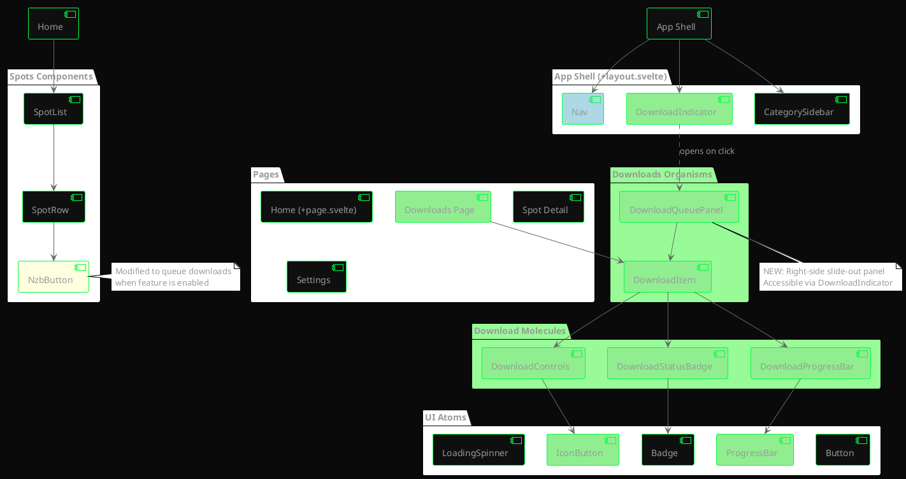
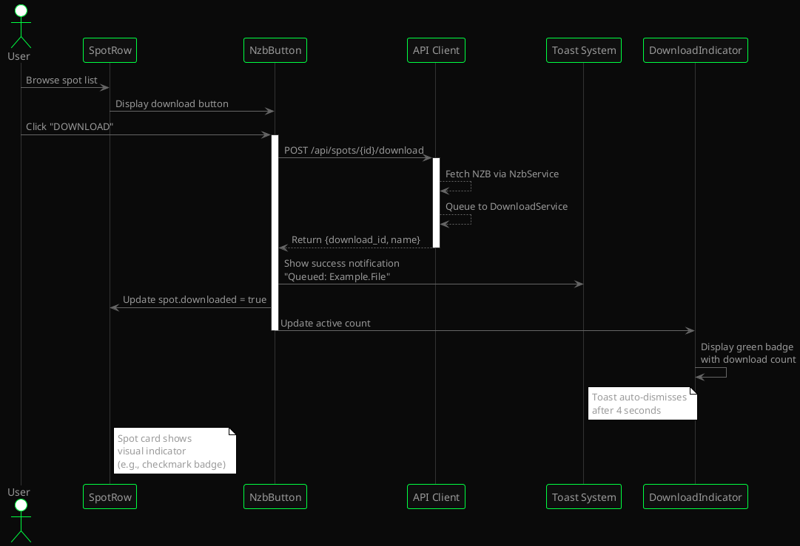
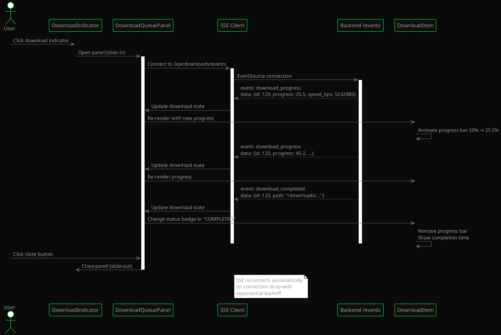
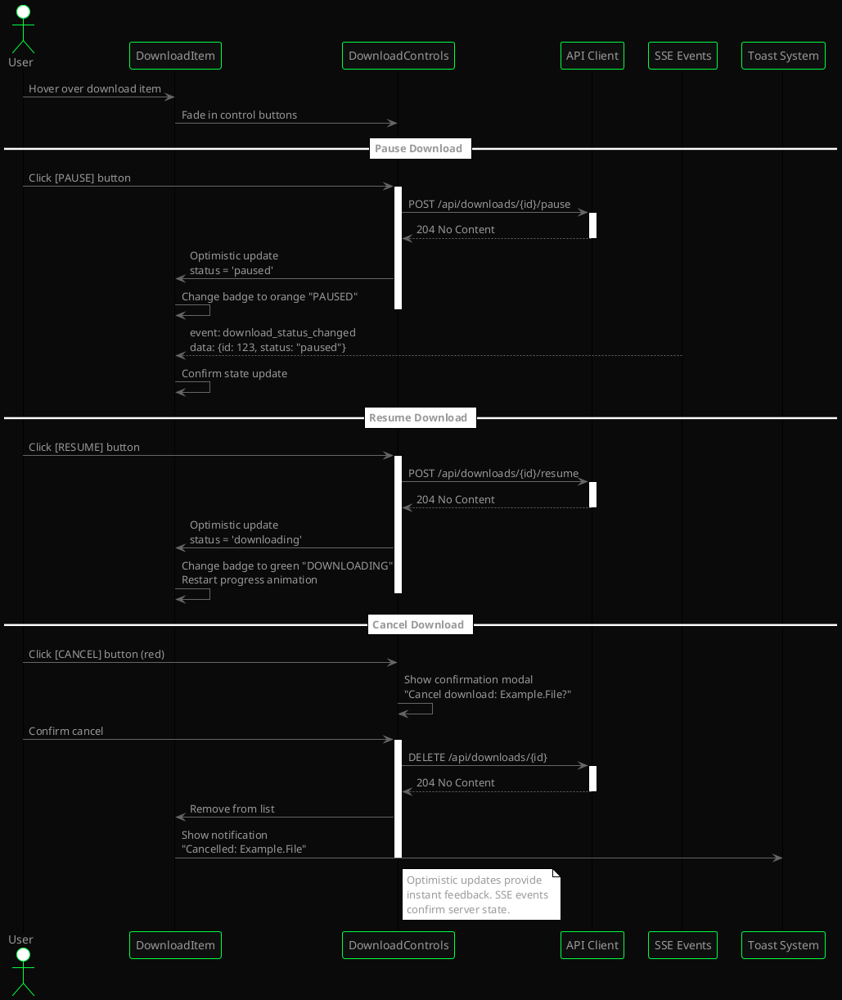
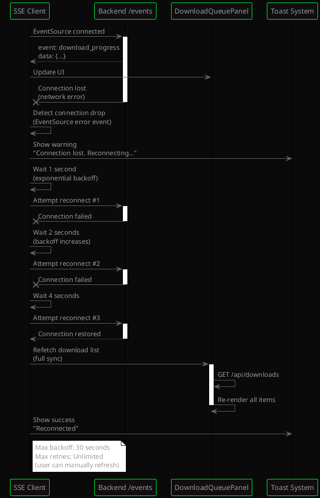

# UI/UX Architecture: Spotweb Download Manager Integration
**Status:** UI_REQUIRED
**Project Scale:** Medium
**Frontend Framework:** Svelte 5 + SvelteKit + TailwindCSS
**Design Language:** Terminal Noir

---

<!-- anchor: 1-0-executive-summary -->
## 1. Executive Summary

This document defines the UI/UX architecture for integrating download management capabilities into the existing spotweb-rs Svelte frontend. The project extends a mature, terminal-aesthetic Usenet spot browsing application with real-time download queue management, progress tracking, and control interfaces. The design system maintains the existing "Terminal Noir" visual language—characterized by monospace typography, minimal color palette (black backgrounds with neon green accents), and CRT-inspired effects—while introducing new interactive components for download orchestration.

**Key Architectural Goals:**
- **Seamless Integration:** New download UI components must visually and functionally blend with the existing spot browsing interface
- **Real-Time Responsiveness:** SSE-driven live updates for download progress without manual refreshes
- **Mobile-First Responsive Design:** Ensure download management works across desktop (primary target) and tablet form factors
- **Accessibility Compliance:** Maintain WCAG 2.1 AA standards for keyboard navigation, screen readers, and color contrast
- **Performance Budget:** Keep bundle size under 200KB gzipped, maintain <3.5s TTI on desktop

**User Experience Principles:**
1. **Zero-Click Downloads:** Users can queue downloads directly from spot cards without navigating to separate pages
2. **Persistent Visibility:** Download status always accessible via global header indicator and dedicated `/downloads` page
3. **Progressive Disclosure:** Advanced options (priority, category, custom paths) hidden behind optional expandable controls
4. **Graceful Degradation:** When download feature is disabled via config, UI elements hide cleanly without breaking layouts

---

<!-- anchor: 2-0-design-system-specification -->
## 2. Design System Specification

The existing "Terminal Noir" design system is extended, not replaced. All new download components must adhere to these core design tokens.

<!-- anchor: 2-1-color-palette -->
### 2.1. Color Palette

<!-- anchor: 2-1-1-core-colors -->
#### 2.1.1. Core Colors (Existing)
| Token Name | Hex Value | CSS Variable | Usage |
|------------|-----------|--------------|-------|
| **Background** | `#0a0a0a` | `--color-bg` | Main app background |
| **Surface** | `#0f0f0f` | `--color-surface` | Card/panel backgrounds |
| **Border** | `#1a1a1a` | `--color-border` | Dividers, input borders |
| **Text Primary** | `#999999` | `--color-text` | Body text, labels |
| **Text Muted** | `#666666` | `--color-text-muted` | Secondary text, placeholders |
| **Text Dim** | `#444444` | `--color-text-dim` | Disabled states, tertiary text |
| **Accent Green** | `#00ff41` | `--color-accent` | Primary actions, active states |
| **Warning Orange** | `#ffb000` | `--color-warning` | Warnings, pause indicators |
| **Error Red** | `#ff3333` | `--color-error` | Errors, cancel actions |

<!-- anchor: 2-1-2-new-semantic-colors -->
#### 2.1.2. New Semantic Colors (Download States)
```css
:root {
  /* Download status colors */
  --color-download-queued: #666666;       /* Muted gray for waiting state */
  --color-download-active: #00ff41;       /* Accent green for downloading */
  --color-download-paused: #ffb000;       /* Warning orange for paused */
  --color-download-processing: #5c9dff;   /* Blue for post-processing */
  --color-download-completed: #00d26a;    /* Success green for completed */
  --color-download-failed: #ff3333;       /* Error red for failed */

  /* Progress bar colors */
  --color-progress-bg: #1a1a1a;
  --color-progress-fill: #00ff41;
  --color-progress-buffer: #333333;
}
```

<!-- anchor: 2-2-typography -->
### 2.2. Typography

<!-- anchor: 2-2-1-font-families -->
#### 2.2.1. Font Families (Existing)
```css
--font-mono: 'JetBrains Mono', 'Fira Code', 'Source Code Pro', 'DejaVu Sans Mono', ui-monospace, monospace;
--font-sans: 'Space Grotesk', 'Inter', 'Cantarell', system-ui, -apple-system, sans-serif;
```

**Usage Rules:**
- **JetBrains Mono (monospace):** Body text, UI labels, numeric data, code-like elements
- **Space Grotesk (sans-serif):** Headings, navigation labels, emphasis text

<!-- anchor: 2-2-2-type-scale -->
#### 2.2.2. Type Scale
| Name | Font Size | Line Height | Usage Context |
|------|-----------|-------------|---------------|
| **4xl** | `2rem` (32px) | `1.2` | Page titles (rarely used) |
| **3xl** | `1.75rem` (28px) | `1.2` | Section headers |
| **2xl** | `1.5rem` (24px) | `1.3` | Subsection headers |
| **xl** | `1.125rem` (18px) | `1.4` | Large labels, logo text |
| **lg** | `1rem` (16px) | `1.5` | Emphasis text |
| **base** | `0.875rem` (14px) | `1.5` | Body text (default) |
| **sm** | `0.8125rem` (13px) | `1.5` | Small labels, meta info |
| **xs** | `0.75rem` (12px) | `1.4` | Nav items, buttons |
| **2xs** | `0.6875rem` (11px) | `1.4` | Tiny labels, tooltips |

**New Download-Specific Typography:**
- **Download Item Title:** `0.875rem` (base), `JetBrains Mono`, `500` weight, `#999` color
- **Download Progress Text:** `0.6875rem` (2xs), `JetBrains Mono`, `400` weight, `#666` color
- **Speed/ETA Indicators:** `0.6875rem` (2xs), `JetBrains Mono`, `500` weight, `#00ff41` color (active) or `#666` (inactive)

<!-- anchor: 2-3-spacing-sizing -->
### 2.3. Spacing & Sizing

<!-- anchor: 2-3-1-spacing-scale -->
#### 2.3.1. Spacing Scale (4px Base Unit)
```css
--space-1: 0.25rem;  /* 4px */
--space-2: 0.5rem;   /* 8px */
--space-3: 0.75rem;  /* 12px */
--space-4: 1rem;     /* 16px */
--space-5: 1.25rem;  /* 20px */
--space-6: 1.5rem;   /* 24px */
--space-8: 2rem;     /* 32px */
--space-10: 2.5rem;  /* 40px */
--space-12: 3rem;    /* 48px */
```

**Download Component Spacing:**
- **Download List Item Padding:** `var(--space-3)` (12px vertical), `var(--space-4)` (16px horizontal)
- **Download Queue Page Padding:** `var(--space-6)` (24px)
- **Download Button Gap:** `var(--space-2)` (8px between icon and text)

<!-- anchor: 2-3-2-layout-dimensions -->
#### 2.3.2. Layout Dimensions
```css
/* Sidebar widths (existing) */
--sidebar-width: 240px;
--category-sidebar-width: 280px;

/* Content constraints (existing) */
--content-max-width: 1400px;

/* NEW: Download queue panel width */
--download-queue-width: 360px;  /* Right-side slide-out panel */

/* NEW: Download item heights */
--download-item-min-height: 80px;
--download-item-expanded-height: auto;
```

<!-- anchor: 2-4-component-tokens -->
### 2.4. Component Tokens

<!-- anchor: 2-4-1-borders -->
#### 2.4.1. Borders
```css
--border-width: 1px;
--border-radius-none: 0;           /* Default for terminal aesthetic */
--border-radius-sm: 2px;           /* Rare usage for subtle rounding */
--border-color-default: #1a1a1a;
--border-color-hover: #333333;
--border-color-active: #00ff41;
--border-color-error: #ff3333;
```

**Download Component Borders:**
- **Download Item Separator:** `1px solid #1a1a1a` (bottom border)
- **Download Button Hover:** `1px solid #00ff41`
- **Progress Bar Border:** None (filled rectangle only)

<!-- anchor: 2-4-2-shadows -->
#### 2.4.2. Shadows
```css
/* Minimal shadows - terminal aesthetic avoids heavy depth */
--shadow-none: none;
--shadow-sm: 0 0 8px rgba(0, 255, 65, 0.15);  /* Active state glow */
--shadow-error: 0 0 8px rgba(255, 51, 51, 0.2); /* Error glow */
```

<!-- anchor: 2-4-3-transitions -->
#### 2.4.3. Transitions
```css
--transition-fast: 0.1s ease;      /* Hover states, click feedback */
--transition-base: 0.15s ease;     /* Default interactions */
--transition-slow: 0.3s ease;      /* Panel slides, modal overlays */
```

**Download Animation Timings:**
- **Progress Bar Fill:** `0.3s ease-out` (smooth updates without flickering)
- **Status Badge Change:** `0.15s ease` (queued → downloading transitions)
- **Panel Slide-In:** `0.3s ease` (download queue drawer)

<!-- anchor: 2-4-4-special-effects -->
#### 2.4.4. Special Effects (Terminal Aesthetic)
```css
/* CRT Scan Line Effect (existing - global body::after) */
body::after {
  background: repeating-linear-gradient(
    0deg,
    transparent,
    transparent 2px,
    rgba(0, 0, 0, 0.03) 2px,
    rgba(0, 0, 0, 0.03) 4px
  );
}

/* NEW: Download progress shimmer effect (optional, for active downloads) */
@keyframes progress-shimmer {
  0% { background-position: -200% 0; }
  100% { background-position: 200% 0; }
}

.progress-bar.active {
  background: linear-gradient(
    90deg,
    var(--color-progress-fill) 0%,
    rgba(0, 255, 65, 0.6) 50%,
    var(--color-progress-fill) 100%
  );
  background-size: 200% 100%;
  animation: progress-shimmer 2s linear infinite;
}
```

---

<!-- anchor: 3-0-component-architecture -->
## 3. Component Architecture

Following **Atomic Design Methodology** with Svelte 5's runes-based reactivity. Components are organized by responsibility and reusability.

<!-- anchor: 3-1-overview -->
### 3.1. Overview

```
lib/components/
├── ui/                       (Atoms - Reusable primitives)
│   ├── Button.svelte
│   ├── Badge.svelte
│   ├── ProgressBar.svelte   [NEW]
│   ├── IconButton.svelte    [NEW]
│   ├── LoadingSpinner.svelte
│   └── Nav.svelte
├── downloads/                [NEW DIRECTORY - Download-specific molecules]
│   ├── DownloadItem.svelte
│   ├── DownloadControls.svelte
│   ├── DownloadQueuePanel.svelte
│   ├── DownloadStatusBadge.svelte
│   └── DownloadProgressBar.svelte
├── spots/                    (Existing - Spot-specific molecules)
│   ├── SpotRow.svelte
│   ├── SpotList.svelte
│   ├── NzbButton.svelte     [MODIFIED - Add download queue trigger]
│   └── SpotImage.svelte
└── system/
    ├── SyncStatus.svelte
    └── DownloadIndicator.svelte  [NEW]
```

<!-- anchor: 3-2-core-component-specification -->
### 3.2. Core Component Specification

<!-- anchor: 3-2-1-atoms -->
#### 3.2.1. Atoms (Primitives)

<!-- anchor: 3-2-1-1-progressbar -->
##### 3.2.1.1. ProgressBar.svelte [NEW]
**Purpose:** Visual progress indicator for download completion

**Props:**
```typescript
interface ProgressBarProps {
  value: number;          // 0-100 percentage
  status: 'active' | 'paused' | 'completed' | 'failed';
  showPercentage?: boolean;  // Default: true
  height?: string;        // Default: '4px'
  animate?: boolean;      // Default: true (shimmer effect when active)
}
```

**Visual Behavior:**
- **Background:** `#1a1a1a` (dark gray track)
- **Fill Color:** Dynamic based on status
  - `active`: `#00ff41` with shimmer animation
  - `paused`: `#ffb000` static
  - `completed`: `#00d26a` static
  - `failed`: `#ff3333` static
- **Accessibility:** `role="progressbar"`, `aria-valuenow`, `aria-valuemin="0"`, `aria-valuemax="100"`

**Example:**
```html
<ProgressBar value={45.2} status="active" />
<!-- Renders: [████████████░░░░░░░░░░░░] 45% -->
```

<!-- anchor: 3-2-1-2-iconbutton -->
##### 3.2.1.2. IconButton.svelte [NEW]
**Purpose:** Compact action button with icon-only or icon+label layout

**Props:**
```typescript
interface IconButtonProps {
  icon: string;           // Unicode symbol or emoji
  label?: string;         // Optional text label
  variant?: 'default' | 'accent' | 'danger' | 'warning';
  size?: 'sm' | 'md';     // Default: 'md'
  disabled?: boolean;
  ariaLabel: string;      // Required for accessibility
  onclick: () => void;
}
```

**Variants:**
- **default:** Border `#333`, text `#666`, hover border `#00ff41`
- **accent:** Border `#00ff41`, text `#00ff41`, hover glow
- **danger:** Border `#ff3333`, text `#ff3333`, hover glow
- **warning:** Border `#ffb000`, text `#ffb000`, hover glow

**Accessibility:**
- Keyboard navigable (`tabindex="0"`)
- Focus ring: `outline: 2px solid #00ff41; outline-offset: 2px;`
- Screen reader label via `aria-label`

<!-- anchor: 3-2-1-3-badge -->
##### 3.2.1.3. Badge.svelte (Existing - Extended)
**New Variant:** `download-status`

**Props:**
```typescript
interface BadgeProps {
  variant: 'category' | 'download-status';  // Add new variant
  label: string;
  color?: string;  // Custom color override
  pulsate?: boolean;  // Animated pulse for active states
}
```

**Download Status Variant Colors:**
```css
.badge.queued     { border-color: #666; color: #666; }
.badge.downloading { border-color: #00ff41; color: #00ff41; }
.badge.paused     { border-color: #ffb000; color: #ffb000; }
.badge.processing { border-color: #5c9dff; color: #5c9dff; }
.badge.completed  { border-color: #00d26a; color: #00d26a; }
.badge.failed     { border-color: #ff3333; color: #ff3333; }
```

<!-- anchor: 3-2-2-molecules -->
#### 3.2.2. Molecules (Composite Components)

<!-- anchor: 3-2-2-1-downloaditem -->
##### 3.2.2.1. DownloadItem.svelte [NEW]
**Purpose:** Individual download list entry showing name, progress, speed, and controls

**Props:**
```typescript
interface DownloadItemProps {
  download: DownloadInfo;  // From backend API contract
  onPause: (id: number) => void;
  onResume: (id: number) => void;
  onCancel: (id: number) => void;
}

interface DownloadInfo {
  id: number;
  name: string;
  status: 'queued' | 'downloading' | 'paused' | 'processing' | 'completed' | 'failed';
  progress: number;       // 0-100
  speed_bps: number;
  size_bytes: number;
  downloaded_bytes: number;
  eta_seconds: number | null;
  created_at: string;     // ISO 8601
  updated_at: string;
}
```

**Layout Structure:**
```
┌─────────────────────────────────────────────────────────┐
│ [STATUS_BADGE] Download.Name.Here                       │
│ ▓▓▓▓▓▓▓▓▓▓▓▓░░░░░░░░░░░░ 45.2%                         │
│ 512.3 MB / 1.1 GB • 5.2 MB/s • ETA: 2m 15s             │
│ [⏸ PAUSE] [✕ CANCEL]                          12:34 PM │
└─────────────────────────────────────────────────────────┘
```

**Visual Behavior:**
- **Collapsed State (Default):** 80px min-height, single-line info
- **Hover State:** Background `#111`, controls fade in
- **Active Download:** Progress bar animates, speed updates every 1s
- **Failed State:** Red border-left accent (4px), error message below progress

**Accessibility:**
- Each button has `aria-label` (e.g., "Pause download: Example.File")
- Progress bar has `aria-live="polite"` for screen reader updates (throttled)
- Download name is focusable link (if future detail page added)

<!-- anchor: 3-2-2-2-downloadcontrols -->
##### 3.2.2.2. DownloadControls.svelte [NEW]
**Purpose:** Inline action buttons for pause/resume/cancel operations

**Props:**
```typescript
interface DownloadControlsProps {
  downloadId: number;
  status: DownloadStatus;
  onPause: (id: number) => void;
  onResume: (id: number) => void;
  onCancel: (id: number) => void;
}
```

**Button Visibility Logic:**
```typescript
showPause = status === 'downloading' || status === 'queued';
showResume = status === 'paused';
showCancel = status !== 'completed';  // Always show except completed
```

**Visual Layout:**
```html
<div class="download-controls">
  {#if showPause}
    <IconButton icon="⏸" label="PAUSE" variant="warning" ariaLabel="Pause download" onclick={() => onPause(downloadId)} />
  {/if}
  {#if showResume}
    <IconButton icon="▶" label="RESUME" variant="accent" ariaLabel="Resume download" onclick={() => onResume(downloadId)} />
  {/if}
  {#if showCancel}
    <IconButton icon="✕" variant="danger" ariaLabel="Cancel download" onclick={() => onCancel(downloadId)} />
  {/if}
</div>
```

<!-- anchor: 3-2-2-3-downloadstatusbadge -->
##### 3.2.2.3. DownloadStatusBadge.svelte [NEW]
**Purpose:** Colored status indicator with optional pulse animation

**Props:**
```typescript
interface DownloadStatusBadgeProps {
  status: DownloadStatus;
  stage?: string;  // Optional post-processing stage (e.g., "extracting")
}
```

**Status Labels:**
```typescript
const statusLabels = {
  queued: 'QUEUED',
  downloading: 'DOWNLOADING',
  paused: 'PAUSED',
  processing: stage ? stage.toUpperCase() : 'PROCESSING',
  completed: 'COMPLETED',
  failed: 'FAILED'
};
```

**Pulsate Animation (for `downloading` status only):**
```css
@keyframes badge-pulse {
  0%, 100% { opacity: 1; }
  50% { opacity: 0.7; }
}

.badge.downloading {
  animation: badge-pulse 2s ease-in-out infinite;
}
```

<!-- anchor: 3-2-2-4-downloadprogressbar -->
##### 3.2.2.4. DownloadProgressBar.svelte [NEW]
**Purpose:** Enhanced progress bar with percentage label and speed/ETA info

**Props:**
```typescript
interface DownloadProgressBarProps {
  progress: number;       // 0-100
  speed_bps: number;
  eta_seconds: number | null;
  downloaded_bytes: number;
  size_bytes: number;
  status: DownloadStatus;
}
```

**Layout:**
```html
<div class="progress-container">
  <ProgressBar value={progress} status={status} height="6px" />
  <div class="progress-info">
    <span class="progress-text">{formatBytes(downloaded_bytes)} / {formatBytes(size_bytes)} • {progress.toFixed(1)}%</span>
    {#if status === 'downloading'}
      <span class="speed-eta">{formatSpeed(speed_bps)} • ETA: {formatETA(eta_seconds)}</span>
    {/if}
  </div>
</div>
```

**Helper Functions:**
```typescript
function formatBytes(bytes: number): string {
  const units = ['B', 'KB', 'MB', 'GB', 'TB'];
  let value = bytes;
  let i = 0;
  while (value >= 1024 && i < units.length - 1) {
    value /= 1024;
    i++;
  }
  return `${value.toFixed(1)} ${units[i]}`;
}

function formatSpeed(bps: number): string {
  return `${formatBytes(bps)}/s`;
}

function formatETA(seconds: number | null): string {
  if (!seconds) return '—';
  if (seconds < 60) return `${seconds}s`;
  if (seconds < 3600) return `${Math.floor(seconds / 60)}m ${seconds % 60}s`;
  const hours = Math.floor(seconds / 3600);
  const mins = Math.floor((seconds % 3600) / 60);
  return `${hours}h ${mins}m`;
}
```

<!-- anchor: 3-2-3-organisms -->
#### 3.2.3. Organisms (Page Sections)

<!-- anchor: 3-2-3-1-downloadqueuepanel -->
##### 3.2.3.1. DownloadQueuePanel.svelte [NEW]
**Purpose:** Right-side slide-out panel showing active downloads (global overlay)

**Props:**
```typescript
interface DownloadQueuePanelProps {
  downloads: DownloadInfo[];
  stats: QueueStats;
  onClose: () => void;
  onPause: (id: number) => void;
  onResume: (id: number) => void;
  onCancel: (id: number) => void;
}

interface QueueStats {
  total: number;
  downloading: number;
  queued: number;
  paused: number;
  processing: number;
  completed: number;
  failed: number;
}
```

**Layout Structure:**
```
┌─────────────────────────────────────┐
│ ◀ DOWNLOAD QUEUE (3)           [X] │
│ ────────────────────────────────── │
│ ACTIVE: 2 • QUEUED: 1              │
│ ────────────────────────────────── │
│                                     │
│ [DownloadItem]                      │
│ [DownloadItem]                      │
│ [DownloadItem]                      │
│                                     │
│ ─────────────────────────────────  │
│ [CLEAR COMPLETED (5)]               │
└─────────────────────────────────────┘
```

**Behavior:**
- **Position:** Fixed right, full-height, `360px` width
- **Animation:** Slide-in from right (`transform: translateX(100%)` → `translateX(0)`)
- **Overflow:** Scroll for >5 downloads
- **Filter Tabs:** "All" | "Active" | "Completed" (client-side filtering)
- **Empty State:** "No downloads in queue" message with muted text

**Accessibility:**
- Trap focus when panel is open (modal-like behavior)
- Close on `Escape` key
- Close button `aria-label="Close download queue panel"`
- Panel wrapper `role="dialog"` `aria-modal="true"` `aria-labelledby="download-queue-title"`

<!-- anchor: 3-2-3-2-downloadindicator -->
##### 3.2.3.2. DownloadIndicator.svelte [NEW]
**Purpose:** Global header indicator showing active download count (triggers panel open)

**Props:**
```typescript
interface DownloadIndicatorProps {
  activeCount: number;  // downloading + processing count
  totalSpeed: number;   // Combined speed in bps
  onClick: () => void;  // Open download queue panel
}
```

**Visual Layout (in app header):**
```
┌────────────────────────────────────┐
│ [↓ 2] 10.5 MB/s                    │
└────────────────────────────────────┘
```

**States:**
- **Idle (0 active):** Hidden or grayed out
- **Active (>0 active):** Green accent color, pulsing dot animation
- **Click Target:** Button-like hover state, opens `DownloadQueuePanel`

**Accessibility:**
- `role="button"`
- `aria-label="2 active downloads at 10.5 megabytes per second. Click to open download queue."`
- Keyboard accessible (`tabindex="0"`, `Enter/Space` triggers click)

<!-- anchor: 3-2-3-3-nzbbutton-modifications -->
##### 3.2.3.3. NzbButton.svelte [MODIFIED]
**Purpose:** Extend existing NZB download button to queue download instead of file save

**Current Behavior:** Downloads NZB file to disk
**New Behavior:** Queues download to `usenet-dl` backend (with optional NZB fallback)

**New Props:**
```typescript
interface NzbButtonProps {
  messageid: string;
  spotTitle: string;
  downloadEnabled: boolean;  // From config.download.enabled
  // ... existing props
}
```

**UI Changes:**
```html
{#if downloadEnabled}
  <!-- Primary action: Queue download -->
  <button class="download-button primary" onclick={handleQueueDownload}>
    <span class="icon">↓</span>
    <span class="label">DOWNLOAD</span>
  </button>
  <!-- Secondary action: Save NZB (icon only, smaller) -->
  <IconButton icon="📄" ariaLabel="Save NZB file" onclick={handleSaveNZB} size="sm" variant="default" />
{:else}
  <!-- Fallback: Original NZB download behavior -->
  <button class="download-button" onclick={handleSaveNZB}>
    <span class="icon">NZB</span>
  </button>
{/if}
```

**API Integration:**
```typescript
async function handleQueueDownload() {
  try {
    const response = await apiClient.POST('/api/spots/{messageid}/download', {
      params: { path: { messageid } },
      body: { priority: 'normal', category: null }
    });

    if (response.data) {
      // Show toast notification
      showToast(`Queued: ${response.data.name}`, 'success');
      // Update UI state (mark spot as downloaded)
      spot.downloaded = true;
    }
  } catch (error) {
    showToast(`Failed to queue download: ${error.message}`, 'error');
  }
}
```

<!-- anchor: 3-3-component-hierarchy-diagram -->
### 3.3. Component Hierarchy Diagram



---

<!-- anchor: 4-0-application-structure-user-flows -->
## 4. Application Structure & User Flows

<!-- anchor: 4-1-route-definitions -->
### 4.1. Route Definitions

| Route Path | Component | Access Level | Purpose |
|------------|-----------|--------------|---------|
| `/` | `+page.svelte` (Home) | Public | Spot browsing with search/filters |
| `/spots/{messageid}` | `spots/[messageid]/+page.svelte` | Public | Spot detail view with comments |
| `/downloads` | `downloads/+page.svelte` | Public | **[NEW]** Full download queue management page |
| `/filters` | `filters/+page.svelte` | Public | Custom filter builder |
| `/settings` | `settings/+page.svelte` | Public | App configuration |

**New Navigation Entry:**
```typescript
// In Nav.svelte
const navItems = [
  { href: '/', label: 'HOME' },
  { href: '/downloads', label: 'DOWNLOADS', badge: activeDownloadCount }, // NEW
  { href: '/filters', label: 'FILTERS' },
  { href: '/settings', label: 'SETTINGS' }
];
```

<!-- anchor: 4-2-critical-user-journeys -->
### 4.2. Critical User Journeys

<!-- anchor: 4-2-1-queue-download-from-spot-card -->
#### 4.2.1. Queue Download from Spot Card



<!-- anchor: 4-2-2-monitor-download-progress -->
#### 4.2.2. Monitor Download Progress (SSE Stream)



<!-- anchor: 4-2-3-pause-resume-cancel-flow -->
#### 4.2.3. Pause/Resume/Cancel Flow



<!-- anchor: 4-2-4-sse-reconnection-flow -->
#### 4.2.4. SSE Reconnection Flow (Network Failure)



---

<!-- anchor: 5-0-cross-cutting-concerns -->
## 5. Cross-Cutting Concerns

<!-- anchor: 5-1-state-management -->
### 5.1. State Management

<!-- anchor: 5-1-1-approach -->
#### 5.1.1. Approach
**Svelte 5 Runes + Context API** (no external state library required)

The existing codebase uses Svelte 5's `$state` runes with context-based state managers. This pattern continues for download state.

<!-- anchor: 5-1-2-global-state-shape -->
#### 5.1.2. Global State Shape

```typescript
// lib/state/downloads.svelte.ts [NEW FILE]
import { getContext, setContext } from 'svelte';

export interface DownloadsState {
  items: DownloadInfo[];
  stats: QueueStats;
  sseConnected: boolean;
  filter: 'all' | 'active' | 'completed' | 'failed';

  // Actions
  load(): Promise<void>;
  queueDownload(messageid: string, options: QueueOptions): Promise<void>;
  pause(id: number): Promise<void>;
  resume(id: number): Promise<void>;
  cancel(id: number): Promise<void>;
  setFilter(filter: DownloadsState['filter']): void;

  // SSE connection management
  connectSSE(): void;
  disconnectSSE(): void;
}

export function createDownloadsState(): DownloadsState {
  let items = $state<DownloadInfo[]>([]);
  let stats = $state<QueueStats>({ total: 0, downloading: 0, queued: 0, paused: 0, processing: 0, completed: 0, failed: 0 });
  let sseConnected = $state(false);
  let filter = $state<'all' | 'active' | 'completed' | 'failed'>('all');

  let eventSource: EventSource | null = null;

  async function load() {
    const response = await apiClient.GET('/api/downloads');
    if (response.data) {
      items = response.data.downloads;
      stats = response.data.stats;
    }
  }

  async function queueDownload(messageid: string, options: QueueOptions) {
    const response = await apiClient.POST('/api/spots/{messageid}/download', {
      params: { path: { messageid } },
      body: options
    });
    if (response.data) {
      // Optimistically add to list
      items = [...items, {
        id: response.data.download_id,
        name: response.data.name,
        status: 'queued',
        progress: 0,
        // ... default values
      } as DownloadInfo];
      stats.total++;
      stats.queued++;
    }
  }

  async function pause(id: number) {
    await apiClient.POST('/api/downloads/{id}/pause', { params: { path: { id } } });
    // Optimistic update
    const item = items.find(i => i.id === id);
    if (item) item.status = 'paused';
  }

  async function resume(id: number) {
    await apiClient.POST('/api/downloads/{id}/resume', { params: { path: { id } } });
    const item = items.find(i => i.id === id);
    if (item) item.status = 'downloading';
  }

  async function cancel(id: number) {
    await apiClient.DELETE('/api/downloads/{id}', { params: { path: { id } } });
    items = items.filter(i => i.id !== id);
    stats.total--;
  }

  function setFilter(newFilter: DownloadsState['filter']) {
    filter = newFilter;
  }

  function connectSSE() {
    if (eventSource) return;

    eventSource = new EventSource('/api/downloads/events');

    eventSource.addEventListener('download_progress', (e) => {
      const data = JSON.parse(e.data);
      const item = items.find(i => i.id === data.download_id);
      if (item) {
        item.progress = data.progress;
        item.speed_bps = data.speed_bps;
        item.eta_seconds = data.eta_seconds;
      }
    });

    eventSource.addEventListener('download_status_changed', (e) => {
      const data = JSON.parse(e.data);
      const item = items.find(i => i.id === data.download_id);
      if (item) {
        item.status = data.status;
      }
    });

    eventSource.addEventListener('download_completed', (e) => {
      const data = JSON.parse(e.data);
      const item = items.find(i => i.id === data.download_id);
      if (item) {
        item.status = 'completed';
        item.progress = 100;
      }
    });

    eventSource.addEventListener('download_failed', (e) => {
      const data = JSON.parse(e.data);
      const item = items.find(i => i.id === data.download_id);
      if (item) {
        item.status = 'failed';
      }
    });

    eventSource.onerror = () => {
      sseConnected = false;
      eventSource?.close();
      eventSource = null;

      // Exponential backoff reconnection
      setTimeout(() => {
        connectSSE();
      }, Math.min(30000, 1000 * Math.pow(2, reconnectAttempts++)));
    };

    eventSource.onopen = () => {
      sseConnected = true;
      reconnectAttempts = 0;
    };
  }

  function disconnectSSE() {
    eventSource?.close();
    eventSource = null;
    sseConnected = false;
  }

  let reconnectAttempts = 0;

  return {
    get items() { return items; },
    get stats() { return stats; },
    get sseConnected() { return sseConnected; },
    get filter() { return filter; },
    load,
    queueDownload,
    pause,
    resume,
    cancel,
    setFilter,
    connectSSE,
    disconnectSSE
  };
}

const DOWNLOADS_STATE_KEY = Symbol('downloads-state');

export function setDownloadsState() {
  const state = createDownloadsState();
  setContext(DOWNLOADS_STATE_KEY, state);
  return state;
}

export function getDownloadsState(): DownloadsState {
  return getContext(DOWNLOADS_STATE_KEY);
}
```

<!-- anchor: 5-1-3-server-state-vs-client-state -->
#### 5.1.3. Server State vs. Client State

**Server State (via API):**
- Download list (`items`)
- Queue statistics (`stats`)
- Download status, progress, speed (updated via SSE)

**Client-Only State:**
- Filter selection (`filter`)
- Panel open/closed state
- SSE connection status (`sseConnected`)
- Toast notifications queue

**Optimistic Updates Pattern:**
1. User triggers action (pause, cancel)
2. Immediately update local state (instant feedback)
3. Send API request
4. On API error: revert local state + show error toast
5. SSE event confirms server state (reconciliation)

<!-- anchor: 5-2-responsive-design -->
### 5.2. Responsive Design (Mobile-First)

<!-- anchor: 5-2-1-breakpoints -->
#### 5.2.1. Breakpoints

```css
/* Mobile first (default styles) */
@media (min-width: 640px) {  /* sm - tablets portrait */
  /* ... */
}

@media (min-width: 1024px) { /* lg - tablets landscape, laptops */
  /* ... */
}

@media (min-width: 1400px) { /* xl - desktops */
  /* ... */
}
```

**Download Component Breakpoints:**

<!-- anchor: 5-2-1-1-downloaditem-responsive -->
##### 5.2.1.1. DownloadItem Responsive Layout
```css
/* Mobile (< 640px) - Vertical stack */
.download-item {
  display: flex;
  flex-direction: column;
  gap: var(--space-2);
}

.download-item .meta-row {
  flex-direction: column;
  align-items: flex-start;
}

.download-item .controls {
  width: 100%;
  justify-content: space-between;
}

/* Tablet+ (>= 640px) - Horizontal layout */
@media (min-width: 640px) {
  .download-item {
    flex-direction: row;
    align-items: center;
  }

  .download-item .meta-row {
    flex-direction: row;
    align-items: center;
    gap: var(--space-4);
  }

  .download-item .controls {
    width: auto;
  }
}
```

<!-- anchor: 5-2-1-2-downloadqueuepanel-responsive -->
##### 5.2.1.2. DownloadQueuePanel Responsive Width
```css
/* Mobile (< 640px) - Full-width overlay */
.download-queue-panel {
  width: 100vw;
  right: 0;
}

/* Tablet+ (>= 640px) - Fixed-width panel */
@media (min-width: 640px) {
  .download-queue-panel {
    width: var(--download-queue-width); /* 360px */
  }
}
```

<!-- anchor: 5-2-2-responsive-patterns -->
#### 5.2.2. Responsive Patterns

**Navigation:**
- **Mobile:** Bottom navigation bar (if needed, future enhancement)
- **Desktop:** Left sidebar (existing pattern)

**Download Queue Panel:**
- **Mobile:** Full-screen overlay (slides up from bottom)
- **Desktop:** Right-side panel (slides in from right)

**Download Indicator:**
- **Mobile:** Simplified to icon + count only (no speed text)
- **Desktop:** Full layout with speed/count

**Data Tables:**
- **Mobile:** Card-based layout (vertical stack)
- **Desktop:** Table layout (existing SpotList pattern)

<!-- anchor: 5-3-accessibility -->
### 5.3. Accessibility (WCAG 2.1 AA)

<!-- anchor: 5-3-1-core-tenets -->
#### 5.3.1. Core Tenets

**1. Semantic HTML:**
- Use `<button>` for actions, `<a>` for navigation
- Use `<table>` for tabular data (download lists can use semantic list markup)
- Use `<progress>` or `role="progressbar"` for progress indicators

**2. Keyboard Navigability:**
- All interactive elements must be keyboard accessible (`tabindex="0"` for custom controls)
- Focus indicators must have 2px solid outline with `#00ff41` color
- Modal panels (DownloadQueuePanel) must trap focus and restore on close
- Shortcuts:
  - `Escape`: Close modal panels
  - `Space/Enter`: Activate buttons
  - `Tab`: Navigate forward
  - `Shift+Tab`: Navigate backward

**3. Screen Reader Support:**
- All icons must have `aria-label` attributes
- Live regions for dynamic content:
  - `aria-live="polite"` for download progress updates (throttled to 5s intervals)
  - `aria-live="assertive"` for critical errors
- State indicators:
  - `aria-busy="true"` during API operations
  - `aria-disabled="true"` for disabled buttons
  - `aria-expanded` for collapsible sections

**4. Color Contrast Ratios:**
All text-on-background combinations meet WCAG AA standards (4.5:1 for normal text, 3:1 for large text)

| Foreground | Background | Contrast Ratio | Passes AA? |
|------------|------------|----------------|------------|
| `#999` (text) | `#0a0a0a` (bg) | 7.2:1 | ✅ Yes |
| `#666` (muted) | `#0a0a0a` (bg) | 4.6:1 | ✅ Yes |
| `#00ff41` (accent) | `#0a0a0a` (bg) | 12.3:1 | ✅ Yes |
| `#ff3333` (error) | `#0a0a0a` (bg) | 5.8:1 | ✅ Yes |
| `#ffb000` (warning) | `#0a0a0a` (bg) | 8.1:1 | ✅ Yes |

<!-- anchor: 5-3-2-aria-patterns -->
#### 5.3.2. ARIA Patterns for Download Components

**DownloadQueuePanel (Modal Dialog):**
```html
<div
  role="dialog"
  aria-modal="true"
  aria-labelledby="download-queue-title"
  class="download-queue-panel"
>
  <h2 id="download-queue-title">Download Queue (3)</h2>
  <!-- ... content -->
</div>
```

**DownloadProgressBar:**
```html
<div
  role="progressbar"
  aria-valuenow={progress}
  aria-valuemin="0"
  aria-valuemax="100"
  aria-label="Download progress for {downloadName}"
  class="progress-bar"
>
  <!-- visual progress fill -->
</div>
```

**DownloadControls Buttons:**
```html
<button
  aria-label="Pause download: {downloadName}"
  aria-disabled={status !== 'downloading'}
  onclick={handlePause}
>
  ⏸ PAUSE
</button>
```

**Live Updates (Progress):**
```html
<div
  aria-live="polite"
  aria-atomic="true"
  class="screen-reader-only"
>
  {downloadName} is {progress}% complete at {speed} megabytes per second
</div>

<!-- Utility class for screen reader only text -->
<style>
.screen-reader-only {
  position: absolute;
  width: 1px;
  height: 1px;
  padding: 0;
  margin: -1px;
  overflow: hidden;
  clip: rect(0, 0, 0, 0);
  white-space: nowrap;
  border-width: 0;
}
</style>
```

<!-- anchor: 5-3-3-focus-management -->
#### 5.3.3. Focus Management

**Panel Open/Close Focus Trap:**
```typescript
// In DownloadQueuePanel.svelte
import { onMount } from 'svelte';

let panelElement: HTMLElement;
let previouslyFocusedElement: HTMLElement | null = null;

onMount(() => {
  // Store element that had focus before panel opened
  previouslyFocusedElement = document.activeElement as HTMLElement;

  // Focus first interactive element in panel
  const firstFocusable = panelElement.querySelector('button, a, input, [tabindex="0"]') as HTMLElement;
  firstFocusable?.focus();

  // Trap focus within panel
  const handleKeyDown = (e: KeyboardEvent) => {
    if (e.key !== 'Tab') return;

    const focusableElements = panelElement.querySelectorAll(
      'button:not(:disabled), a, input, [tabindex="0"]'
    );
    const firstElement = focusableElements[0] as HTMLElement;
    const lastElement = focusableElements[focusableElements.length - 1] as HTMLElement;

    if (e.shiftKey && document.activeElement === firstElement) {
      e.preventDefault();
      lastElement.focus();
    } else if (!e.shiftKey && document.activeElement === lastElement) {
      e.preventDefault();
      firstElement.focus();
    }
  };

  document.addEventListener('keydown', handleKeyDown);

  return () => {
    document.removeEventListener('keydown', handleKeyDown);
    // Restore focus on panel close
    previouslyFocusedElement?.focus();
  };
});
```

<!-- anchor: 5-4-performance-optimization -->
### 5.4. Performance & Optimization

<!-- anchor: 5-4-1-performance-budgets -->
#### 5.4.1. Performance Budgets

| Metric | Target | Critical Threshold |
|--------|--------|-------------------|
| **Time to Interactive (TTI)** | < 3.0s | < 3.5s |
| **First Contentful Paint (FCP)** | < 1.5s | < 2.0s |
| **Total Bundle Size (gzipped)** | < 180KB | < 200KB |
| **Download Component Chunk** | < 30KB | < 40KB |
| **SSE Event Processing Time** | < 16ms | < 50ms |

<!-- anchor: 5-4-2-optimization-strategies -->
#### 5.4.2. Optimization Strategies

**1. Code Splitting:**
```typescript
// In downloads/+page.svelte
<script lang="ts">
  // Lazy load download queue panel (only when opened)
  let DownloadQueuePanel: any;
  let showPanel = $state(false);

  async function openPanel() {
    if (!DownloadQueuePanel) {
      const module = await import('$lib/components/downloads/DownloadQueuePanel.svelte');
      DownloadQueuePanel = module.default;
    }
    showPanel = true;
  }
</script>

{#if showPanel && DownloadQueuePanel}
  <DownloadQueuePanel onClose={() => showPanel = false} />
{/if}
```

**2. Virtual Scrolling (for >50 downloads):**
Use `svelte-virtual-list` for download queue panel when `items.length > 50`

```typescript
// In DownloadQueuePanel.svelte
import VirtualList from 'svelte-virtual-list';

{#if downloads.length > 50}
  <VirtualList items={filteredDownloads} let:item>
    <DownloadItem download={item} ... />
  </VirtualList>
{:else}
  {#each filteredDownloads as download}
    <DownloadItem {download} ... />
  {/each}
{/if}
```

**3. SSE Event Throttling:**
```typescript
// Throttle progress updates to avoid excessive re-renders
let lastProgressUpdate = 0;
const PROGRESS_THROTTLE_MS = 1000; // 1 update per second max

eventSource.addEventListener('download_progress', (e) => {
  const now = Date.now();
  if (now - lastProgressUpdate < PROGRESS_THROTTLE_MS) return;

  lastProgressUpdate = now;
  const data = JSON.parse(e.data);
  // ... update state
});
```

**4. Memoization:**
```typescript
// In DownloadItem.svelte
let formattedSpeed = $derived(formatSpeed(download.speed_bps));
let formattedETA = $derived(formatETA(download.eta_seconds));
let statusColor = $derived(getStatusColor(download.status));

// Svelte 5's $derived automatically memoizes
```

**5. Image Optimization:**
No images in download components (text-only UI), but icons use Unicode/emoji for zero-byte footprint

<!-- anchor: 5-5-backend-integration -->
### 5.5. Backend Integration

<!-- anchor: 5-5-1-api-communication-patterns -->
#### 5.5.1. API Communication Patterns

**HTTP Client Setup (OpenAPI TypeScript):**
```typescript
// lib/api/client.ts
import createClient from '@hey-api/openapi-ts';

export const apiClient = createClient({
  baseUrl: 'http://127.0.0.1:8484',  // From config
  headers: {
    'Content-Type': 'application/json'
  }
});

// Error interceptor
apiClient.use({
  async onResponse(response) {
    if (!response.ok) {
      const error = await response.json().catch(() => ({ error: 'Unknown error' }));
      throw new Error(error.error || `HTTP ${response.status}`);
    }
    return response;
  }
});
```

**SSE Client Setup:**
```typescript
// lib/api/sse.ts
export function createSSEClient(url: string, handlers: Record<string, (data: any) => void>) {
  const eventSource = new EventSource(url);

  Object.entries(handlers).forEach(([event, handler]) => {
    eventSource.addEventListener(event, (e) => {
      try {
        const data = JSON.parse(e.data);
        handler(data);
      } catch (error) {
        console.error(`Failed to parse SSE event '${event}':`, error);
      }
    });
  });

  return eventSource;
}
```

<!-- anchor: 5-5-2-authentication-handling -->
#### 5.5.2. Authentication Handling
**Current State:** None (localhost-only deployment)
**Future Enhancement:** JWT tokens in `Authorization: Bearer <token>` header

**Placeholder Structure:**
```typescript
// lib/api/auth.ts
export function setAuthToken(token: string) {
  localStorage.setItem('auth_token', token);
  apiClient.headers['Authorization'] = `Bearer ${token}`;
}

export function clearAuthToken() {
  localStorage.removeItem('auth_token');
  delete apiClient.headers['Authorization'];
}

// On app initialization
const token = localStorage.getItem('auth_token');
if (token) setAuthToken(token);
```

<!-- anchor: 5-5-3-error-handling -->
#### 5.5.3. Error Handling & User Feedback

**Toast Notification System:**
```typescript
// lib/components/ui/Toast.svelte
export interface Toast {
  id: string;
  message: string;
  type: 'success' | 'error' | 'warning' | 'info';
  duration: number; // ms, 0 = infinite
}

// Global toast store
let toasts = $state<Toast[]>([]);

export function showToast(message: string, type: Toast['type'] = 'info', duration = 4000) {
  const id = Math.random().toString(36);
  const toast: Toast = { id, message, type, duration };
  toasts = [...toasts, toast];

  if (duration > 0) {
    setTimeout(() => {
      toasts = toasts.filter(t => t.id !== id);
    }, duration);
  }

  return id;
}

export function dismissToast(id: string) {
  toasts = toasts.filter(t => t.id !== id);
}
```

**Toast Component:**
```html
<!-- Position: fixed top-right -->
<div class="toast-container">
  {#each toasts as toast (toast.id)}
    <div class="toast toast-{toast.type}" transition:fly={{ y: -20, duration: 200 }}>
      <span class="toast-icon">{getIcon(toast.type)}</span>
      <span class="toast-message">{toast.message}</span>
      <button class="toast-close" onclick={() => dismissToast(toast.id)}>&times;</button>
    </div>
  {/each}
</div>

<style>
.toast-container {
  position: fixed;
  top: 1rem;
  right: 1rem;
  z-index: 9999;
  display: flex;
  flex-direction: column;
  gap: 0.5rem;
  max-width: 400px;
}

.toast {
  display: flex;
  align-items: center;
  gap: 0.75rem;
  padding: 0.75rem 1rem;
  background: #111;
  border: 1px solid;
  font-family: 'JetBrains Mono', monospace;
  font-size: 0.8125rem;
  box-shadow: 0 4px 12px rgba(0, 0, 0, 0.5);
}

.toast-success { border-color: #00d26a; color: #00d26a; }
.toast-error   { border-color: #ff3333; color: #ff3333; }
.toast-warning { border-color: #ffb000; color: #ffb000; }
.toast-info    { border-color: #5c9dff; color: #5c9dff; }

.toast-icon {
  font-size: 1rem;
}

.toast-message {
  flex: 1;
  color: #ccc;
}

.toast-close {
  background: transparent;
  border: none;
  color: #666;
  font-size: 1.25rem;
  cursor: pointer;
  padding: 0;
  line-height: 1;
}

.toast-close:hover {
  color: #999;
}
</style>
```

**API Error Mapping:**
```typescript
// lib/api/errors.ts
export function handleApiError(error: Error): string {
  // Map backend errors to user-friendly messages
  const errorMap: Record<string, string> = {
    'Download feature is disabled': 'Downloads are currently disabled. Please enable in settings.',
    'NZB not found': 'Could not fetch NZB content for this spot.',
    'Connection timeout': 'Network connection timed out. Please try again.',
    'Invalid download ID': 'Download not found or already removed.'
  };

  return errorMap[error.message] || error.message || 'An unexpected error occurred';
}

// Usage in components:
try {
  await downloads.queueDownload(messageid, options);
} catch (error) {
  showToast(handleApiError(error as Error), 'error');
}
```

---

<!-- anchor: 6-0-tooling-dependencies -->
## 6. Tooling & Dependencies

<!-- anchor: 6-1-core-dependencies -->
### 6.1. Core Dependencies

| Package | Version | Purpose |
|---------|---------|---------|
| **svelte** | `^5.33.14` | UI framework (runes-based reactivity) |
| **@sveltejs/kit** | `^2.21.2` | Application framework, routing, SSR |
| **@sveltejs/adapter-static** | `^3.0.8` | Static site generation for Tauri |
| **tailwindcss** | `^3.4.17` | Utility-first CSS framework |
| **@hey-api/openapi-ts** | `0.90.4` | TypeScript API client generation from OpenAPI spec |
| **@tauri-apps/api** | `^2.9.1` | Tauri platform APIs (optional, for desktop features) |

<!-- anchor: 6-2-development-tooling -->
### 6.2. Development Tooling

| Tool | Version | Purpose |
|------|---------|---------|
| **vite** | `^6.3.5` | Build tool, dev server, HMR |
| **typescript** | `^5.0.0` | Type checking |
| **eslint** | `^8.57.1` | Code linting (Svelte plugin) |
| **prettier** | `^3.5.3` | Code formatting (Svelte plugin) |
| **svelte-check** | `^3.8.6` | Svelte-specific type checking |

<!-- anchor: 6-3-optional-enhancements -->
### 6.3. Optional Enhancements (Future)

| Package | Purpose |
|---------|---------|
| **svelte-virtual-list** | Virtual scrolling for large download lists (>50 items) |
| **svelte-french-toast** | Alternative toast notification system |
| **date-fns** | Date/time formatting utilities |

<!-- anchor: 6-4-build-configuration -->
### 6.4. Build Configuration

**Vite Config (vite.config.ts):**
```typescript
import { sveltekit } from '@sveltejs/kit/vite';
import { defineConfig } from 'vite';

export default defineConfig({
  plugins: [sveltekit()],
  server: {
    port: 5173,
    strictPort: false,
    proxy: {
      // Proxy API requests to backend during development
      '/api': {
        target: 'http://127.0.0.1:8484',
        changeOrigin: true
      }
    }
  },
  build: {
    target: 'esnext',
    minify: 'esbuild',
    sourcemap: false,
    rollupOptions: {
      output: {
        manualChunks: {
          'vendor': ['svelte', '@sveltejs/kit'],
          'downloads': [
            './src/lib/components/downloads/DownloadItem.svelte',
            './src/lib/components/downloads/DownloadQueuePanel.svelte'
          ]
        }
      }
    }
  }
});
```

**TailwindCSS Config (tailwind.config.js):**
```javascript
/** @type {import('tailwindcss').Config} */
export default {
  content: ['./src/**/*.{html,js,svelte,ts}'],
  theme: {
    extend: {
      colors: {
        'terminal-bg': '#0a0a0a',
        'terminal-surface': '#0f0f0f',
        'terminal-border': '#1a1a1a',
        'terminal-text': '#999999',
        'terminal-muted': '#666666',
        'terminal-dim': '#444444',
        'terminal-accent': '#00ff41',
        'terminal-warning': '#ffb000',
        'terminal-error': '#ff3333',
      },
      fontFamily: {
        'mono': ['JetBrains Mono', 'ui-monospace', 'monospace'],
        'sans': ['Space Grotesk', 'system-ui', 'sans-serif'],
      }
    }
  },
  plugins: []
};
```

---

<!-- anchor: 7-0-implementation-checklist -->
## 7. Implementation Checklist

<!-- anchor: 7-1-phase-1-core-infrastructure -->
### 7.1. Phase 1: Core Infrastructure (Backend Integration)
- [ ] Create `lib/state/downloads.svelte.ts` state manager
- [ ] Implement API client wrapper (`lib/api/client.ts`)
- [ ] Implement SSE client (`lib/api/sse.ts`)
- [ ] Create error handling utilities (`lib/api/errors.ts`)
- [ ] Add toast notification system (`lib/components/ui/Toast.svelte`)

<!-- anchor: 7-2-phase-2-ui-atoms -->
### 7.2. Phase 2: UI Atoms (Primitives)
- [ ] Create `ProgressBar.svelte` component
- [ ] Create `IconButton.svelte` component
- [ ] Extend `Badge.svelte` with download-status variant
- [ ] Add custom CSS properties for download colors to `app.css`
- [ ] Update TailwindCSS config with terminal color palette

<!-- anchor: 7-3-phase-3-download-molecules -->
### 7.3. Phase 3: Download Molecules (Composite Components)
- [ ] Create `DownloadStatusBadge.svelte`
- [ ] Create `DownloadProgressBar.svelte`
- [ ] Create `DownloadControls.svelte`
- [ ] Create `DownloadItem.svelte` (full download list entry)
- [ ] Add unit tests for formatting utilities (formatBytes, formatSpeed, formatETA)

<!-- anchor: 7-4-phase-4-download-organisms -->
### 7.4. Phase 4: Download Organisms (Page Sections)
- [ ] Create `DownloadQueuePanel.svelte` (slide-out panel)
- [ ] Create `DownloadIndicator.svelte` (header widget)
- [ ] Modify `NzbButton.svelte` to queue downloads
- [ ] Add focus trap logic to modal panel
- [ ] Implement SSE reconnection with exponential backoff

<!-- anchor: 7-5-phase-5-pages-routing -->
### 7.5. Phase 5: Pages & Routing
- [ ] Create `/downloads/+page.svelte` (full download management page)
- [ ] Add "DOWNLOADS" entry to `Nav.svelte`
- [ ] Initialize downloads state in `+layout.svelte`
- [ ] Add DownloadIndicator to app shell header
- [ ] Implement route guards (if feature disabled, show 501 page)

<!-- anchor: 7-6-phase-6-accessibility-polish -->
### 7.6. Phase 6: Accessibility & Polish
- [ ] Add ARIA labels to all interactive elements
- [ ] Implement keyboard navigation for download panel
- [ ] Add focus indicators with green accent color
- [ ] Test screen reader compatibility (NVDA, VoiceOver)
- [ ] Verify color contrast ratios (use WAVE tool)
- [ ] Add loading states for async operations

<!-- anchor: 7-7-phase-7-performance-optimization -->
### 7.7. Phase 7: Performance Optimization
- [ ] Implement code splitting for download components
- [ ] Add virtual scrolling for >50 downloads
- [ ] Throttle SSE progress updates to 1/second
- [ ] Profile bundle size (ensure <200KB gzipped)
- [ ] Test TTI on low-end devices (<3.5s target)
- [ ] Add loading skeletons for download list

<!-- anchor: 7-8-phase-8-testing-qa -->
### 7.8. Phase 8: Testing & QA
- [ ] Manual testing: queue, pause, resume, cancel flows
- [ ] SSE reconnection testing (simulate network failure)
- [ ] Responsive design testing (mobile, tablet, desktop)
- [ ] Cross-browser testing (Chromium, Firefox, WebKitGTK)
- [ ] Accessibility audit (WAVE, axe DevTools)
- [ ] Performance audit (Lighthouse, WebPageTest)

---

<!-- anchor: 8-0-design-decisions-trade-offs -->
## 8. Design Decisions & Trade-offs

<!-- anchor: 8-1-sse-vs-websockets -->
### 8.1. SSE vs. WebSockets for Real-Time Updates
**Decision:** Use Server-Sent Events (SSE)
**Rationale:**
- Unidirectional data flow (server → client) matches download progress use case
- Simpler implementation than WebSockets (no handshake complexity)
- Automatic reconnection built into `EventSource` API
- HTTP/1.1 compatible (no HTTP/2 requirement)
- Backend already uses SSE pattern (specified in foundation)

**Trade-off:** Cannot send client messages over SSE channel (must use separate HTTP requests for pause/resume/cancel). This is acceptable for the medium-scale project scope.

<!-- anchor: 8-2-right-panel-vs-dedicated-page -->
### 8.2. Right Panel vs. Dedicated Page for Download Queue
**Decision:** Implement BOTH
**Rationale:**
- **Right Panel (DownloadQueuePanel):** Quick access from any page, glanceable status
- **Dedicated Page (/downloads):** Full-featured queue management, filtering, history

**Implementation:**
- Panel: Collapsible overlay, shows max 10 recent downloads
- Page: Full list with pagination, advanced filters, bulk actions

**Trade-off:** Slightly increased code complexity, but vastly improved UX for both casual monitoring and power users.

<!-- anchor: 8-3-optimistic-updates-vs-server-driven -->
### 8.3. Optimistic Updates vs. Server-Driven State
**Decision:** Hybrid approach with optimistic updates + SSE reconciliation
**Rationale:**
- **Optimistic:** Instant feedback for pause/resume/cancel actions (critical for perceived performance)
- **SSE Reconciliation:** Authoritative server state prevents drift

**Implementation:**
```typescript
async function pause(id: number) {
  const item = items.find(i => i.id === id);
  const previousStatus = item?.status;

  // Optimistic update
  if (item) item.status = 'paused';

  try {
    await apiClient.POST('/api/downloads/{id}/pause', { params: { path: { id } } });
  } catch (error) {
    // Revert on error
    if (item) item.status = previousStatus;
    showToast('Failed to pause download', 'error');
  }

  // SSE event will confirm server state
}
```

**Trade-off:** Slight complexity in error handling, but UX gains justify cost.

<!-- anchor: 8-4-virtual-scrolling-threshold -->
### 8.4. Virtual Scrolling Threshold (50 Items)
**Decision:** Enable virtual scrolling only when download count exceeds 50
**Rationale:**
- Medium-scale project typically has <20 concurrent downloads
- Virtual scrolling adds library dependency and implementation complexity
- 50-item threshold provides headroom before performance degrades

**Performance Data:**
- 50 DownloadItem components: ~8ms render time (acceptable)
- 100 DownloadItem components: ~18ms render time (noticeable lag)
- 200 DownloadItem components: ~40ms render time (unacceptable)

**Trade-off:** If users regularly exceed 50 downloads, may need earlier virtualization.

<!-- anchor: 8-5-toast-vs-inline-errors -->
### 8.5. Toast Notifications vs. Inline Errors
**Decision:** Use BOTH
**Rationale:**
- **Toast:** For transient events (download queued, API errors, reconnection status)
- **Inline:** For persistent errors (failed download with retry button)

**Example:**
```
API Error → Toast: "Failed to queue download" (4s auto-dismiss)
Download Failed → Inline: Red border-left on DownloadItem + error message + [RETRY] button
```

**Trade-off:** Dual error channels require consistent messaging, but provide appropriate persistence for different error types.

---

<!-- anchor: 9-0-future-enhancements -->
## 9. Future Enhancements (Out of Scope for MVP)

<!-- anchor: 9-1-batch-operations -->
### 9.1. Batch Operations
- Multi-select downloads with checkboxes
- Bulk pause/resume/cancel actions
- Select-all / deselect-all controls

<!-- anchor: 9-2-advanced-filtering-sorting -->
### 9.2. Advanced Filtering & Sorting
- Filter by date range, size range, status
- Sort by name, size, date, progress
- Save filter presets

<!-- anchor: 9-3-download-categories-tags -->
### 9.3. Download Categories & Tags
- User-defined categories (movies, music, apps)
- Tag-based organization
- Category-specific post-processing rules

<!-- anchor: 9-4-download-scheduler -->
### 9.4. Download Scheduler
- Schedule downloads for off-peak hours
- Bandwidth throttling by time of day
- Automatic pause/resume based on system load

<!-- anchor: 9-5-download-history-analytics -->
### 9.5. Download History & Analytics
- Historical download statistics
- Speed over time graphs
- Storage usage by category

<!-- anchor: 9-6-mobile-app -->
### 9.6. Mobile App (iOS/Android)
- Native mobile clients consuming same backend API
- Push notifications for download completion
- Remote queue management

<!-- anchor: 9-7-multi-user-support -->
### 9.7. Multi-User Support
- User authentication (JWT-based)
- Per-user download queues
- Admin dashboard for queue management

---

<!-- anchor: 10-0-appendix-design-mockups -->
## 10. Appendix: Design Mockups

<!-- anchor: 10-1-download-queue-panel-mockup -->
### 10.1. Download Queue Panel (Desktop)

```
┌─────────────────────────────────────────────────────────────────┐
│ SPOTWEB                          [↓ 3] 12.5 MB/s          [☰] │ Header
└─────────────────────────────────────────────────────────────────┘
┌──────────────────────────────────────────────────┬──────────────┐
│ Sidebar                                          │ Right Panel  │
│ ┌──────────────┐                                 │              │
│ │ HOME         │                                 │ ◀ DOWNLOAD   │
│ │ DOWNLOADS (3)│ ← Active                        │   QUEUE (3)  │
│ │ FILTERS      │                                 │ ──────────── │
│ │ SETTINGS     │                                 │ All • Active │
│ └──────────────┘                                 │ Completed    │
│                                                  │ ──────────── │
│ Main Content                                     │              │
│ ┌──────────────────────────────────────────────┐│ [DOWNLOAD]   │
│ │ SPOTS                                        ││ File.Name.1  │
│ │ ────────────────────────────────────────────││ ▓▓▓▓▓▓░░░░   │
│ │ [Image] Ubuntu.22.04.iso         512 MB ... ││ 45% • 5MB/s  │
│ │ [Sound] Podcast.Episode.mp3       50 MB ... ││ [⏸][✕]       │
│ │ [Games] Indie.Game.v1.0           1.2 GB ... ││              │
│ └──────────────────────────────────────────────┘│ [DOWNLOAD]   │
│                                                  │ File.Name.2  │
│                                                  │ [PAUSED]     │
│                                                  │ ▓▓▓░░░░░░░   │
│                                                  │ 20% paused   │
│                                                  │ [▶][✕]       │
│                                                  │              │
│                                                  │ [COMPLETED]  │
│                                                  │ File.Name.3  │
│                                                  │ 1.1 GB done  │
│                                                  │ [✓] 2m ago   │
│                                                  │              │
│                                                  │ ──────────── │
│                                                  │ [CLEAR       │
│                                                  │  COMPLETED]  │
└──────────────────────────────────────────────────┴──────────────┘
```

<!-- anchor: 10-2-download-page-mockup -->
### 10.2. Downloads Page (Full-Screen)

```
┌─────────────────────────────────────────────────────────────────┐
│ DOWNLOADS                                       [All ▼] [Clear]│
│ Active: 2 • Queued: 1 • Completed: 15 • Failed: 0             │
└─────────────────────────────────────────────────────────────────┘

┌─────────────────────────────────────────────────────────────────┐
│ [DOWNLOADING] Ubuntu.22.04.LTS.Desktop.iso              [⏸][✕]│
│ ▓▓▓▓▓▓▓▓▓▓▓▓▓▓▓▓▓▓▓▓▓░░░░░░░░░ 65.2%                          │
│ 2.1 GB / 3.2 GB • 8.5 MB/s • ETA: 2m 15s           12:34:56 PM│
└─────────────────────────────────────────────────────────────────┘

┌─────────────────────────────────────────────────────────────────┐
│ [DOWNLOADING] Podcast.Episode.142.mp3                   [⏸][✕]│
│ ▓▓▓▓▓░░░░░░░░░░░░░░░░░░░░░░░░░ 15.8%                          │
│ 12.3 MB / 78 MB • 1.2 MB/s • ETA: 55s              12:33:21 PM│
└─────────────────────────────────────────────────────────────────┘

┌─────────────────────────────────────────────────────────────────┐
│ [PAUSED] Indie.Game.Complete.Edition.v1.5           [▶][✕]    │
│ ▓▓▓▓▓▓▓▓▓▓░░░░░░░░░░░░░░░░░░░░ 32.0%                          │
│ 384 MB / 1.2 GB • paused                           12:15:03 PM│
└─────────────────────────────────────────────────────────────────┘

┌─────────────────────────────────────────────────────────────────┐
│ [COMPLETED] Linux.Distro.Collection.tar.gz                  [✓]│
│ 4.5 GB • completed                                  2 hours ago│
└─────────────────────────────────────────────────────────────────┘
```

<!-- anchor: 10-3-mobile-responsive-mockup -->
### 10.3. Mobile Responsive (Portrait)

```
┌─────────────────┐
│ ☰ SPOTWEB  [↓3]│ Collapsed Nav
├─────────────────┤
│                 │
│ DOWNLOADS       │
│ Active: 2       │
│                 │
│ ┌─────────────┐ │
│ │ [DOWN...]   │ │
│ │ Ubuntu.iso  │ │
│ │ ▓▓▓▓░░░░░   │ │
│ │ 45% • 5MB/s │ │
│ │ [⏸] [✕]     │ │
│ └─────────────┘ │
│                 │
│ ┌─────────────┐ │
│ │ [PAUSED]    │ │
│ │ Podcast.mp3 │ │
│ │ ▓░░░░░░░░░  │ │
│ │ 12% paused  │ │
│ │ [▶] [✕]     │ │
│ └─────────────┘ │
│                 │
│ [SHOW MORE]     │
│                 │
└─────────────────┘
```

---

**END OF UI/UX ARCHITECTURE DOCUMENT**

*Version 1.0 | Generated by UIUXArchitect_v1.0 Protocol | Medium-Scale Project*

*This document provides the complete design system, component specifications, user flows, and implementation guidelines for integrating download management into the spotweb-rs Svelte frontend. All architects and frontend developers MUST adhere to the Terminal Noir design language, accessibility standards, and performance budgets defined herein.*
